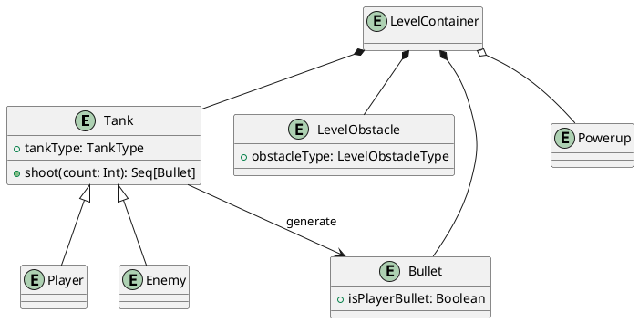

# 1 Processo di sviluppo

Per lo sviluppo del progetto è stata utilizzata la tecnica SCRUM, dove l'intero processo è stato pensato tenendo in considerazione le differenti possibilità che ogni membro del team aveva in termini di tempo e di fasce orarie lavorative.
# 1.1 Divisione in itinere dei task
La gestione e suddivisione delle task è stata fatta durante la riunione dello sprint planning, creando epic e user story nel backlog e assegnandoli ai singoli membri del team.
Successivamente, ogni membro estrapolava dalle proprie user story una o più specifiche sprint task da svolgere, che venivano infine aggiunte allo sprint backlog corrente.
# 1.2 Meeting/interazioni pianificate
Avendo ogni membro del team disponibilità diverse di orario, è stato deciso di svolgere un meeting in presenza il lunedì ogni due settimane per effettuare:
- La sprint review, per lo sprint corrente;
- Lo sprint planning, per il prossimo sprint.

Di conseguenza, anche gli sprint avevano durata bi-settimanale: piccole riunioni e confronti da remoto (e in rare occasioni, anche in presenza) erano svolte durante lo sprint
anche con solo parti del team per verificare l'andamento e per un'eventuale ri-organizzazione degli assegnamenti di alcune sprint task.
# 1.3 Revisione in itinere dei task
Per verificare la completezza e la correttezza dei task sono stati adottati (quando possibile):
- Unit test, per la verifica delle singole sprint task e la corretta implementazione delle funzionalità richieste per queste;
- Acceptance test, per la verifica delle user story e del comportamento generale dei sistemi dell'applicazione.
Questi ultimi sono anche stati scelti come *definition of done*, ovvero come metodo di decisione se una certa user story era da considerare come completata.
# 1.4 Strumenti di Test, Build e CI
## 1.4.1 Test
Per la stesura dei test abbiamo utilizzato *scalatest*, sia per gli unit test che per gli acceptance test. Questo ci ha permesso, sfruttando le funzionalità scala e scalatest avanzate, di scrivere dei test in in linguaggio semi-naturale, tali che fossero semplici da capire anche per chi non li avesse direttamente scritti.
## 1.4.2 Build
Il build tool scelto è *sbt*, per la sua alta integrazione con Scala e per la sua natura multipiattaforma, in quanto avevamo necessità di lavorare su più sistemi operativi.
## 1.4.3 CI/CD
Utilizzando *GitHub* come DVCS, è risultato naturale scegliere le *GitHub Actions* come strumento di CI/CD, non solo per il fatto che nel piano base di GitHub vengono forniti un numero di minuti di esecuzione a noi sufficenti (per evitare comunque di terminare il tempo di esecuzione disponibile abbiamo applicato le action solo sulla main branch), ma anche per la presenza di azioni predefinite per progetti in Scala con sbt, che richiedono una minima configurazione per poter essere operativi.
Sfruttando queste azioni avevamo non solo l'esecuzione dei test ad ogni commit, ma anche una verifica su aggiornamenti o vulnerabilità delle dipendenze del progetto tramite la funzionalità dependabot di GitHub.

# 2 Requisiti

# 2.1 Business
L'applicazione sviluppata dovrà avere le seguenti caratteristiche:
- Permettere all'utente di giocare più partite ad un clone del gioco [Battle City](https://it.wikipedia.org/wiki/Battle_City) nella sua modalità classica a giocatore singolo;
- Opzionalmente, potranno essere rese disponibili altre modalità di gioco alternative;
- L'applicativo dovrà replicare, nel modo più fedele possibile, le meccaniche di gioco base.
# 2.2 Modello del dominio
Il dominio è definito dalle caratteristiche del gioco Battle City (con tutte le sue funzionalità e restrizioni descritte nel paragrafo [business](2_Requisiti.md#2%201%20Business)). 
Ciò comporta il controllo di un carro armato attraverso una mappa labirintica, la distruzione dei carri nemici e la protezione della propria base supportati da eventuali potenziamenti.
Le seguenti entità sono state estrapolate nel definire un modello per tale dominio:
 1. **Contenitore del livello**: rappresenta un singolo stage all'interno del gioco;
 2. **Carro armato**: entità attiva principale del gioco, rappresenta in contemporanea l'agente con cui interagisce l'utente (giocatore) e una serie di entità manipolate da AI (nemici);
 3. **Ostacolo**: costituiscono la struttura dei livelli, possono avere diverse caratteristiche a seconda della loro categoria. La base del player rappresenta l'ostacolo più importante: la sua distruzione da parte dei nemici comporta la sconfitta istantanea;
 4. **Potenziamento**: possono essere raccolti sul suolo del livello durante il gioco: forniscono svariati bonus e migliorie per il carro armato del giocatore, depotenziamenti per i nemici o alterazioni del livello di gioco;
 5. **Proiettile**: permette di danneggiare nemici o il giocatore.

# 2.3 Funzionali
## 2.3.1 Utente
### 2.3.1.1 Menù principale e delle opzioni
- Pulsante per avviare di una nuova partita;
- Possibilità di modificare il nome dell'utente;
- Possibilità di azzerare il punteggio massimo salvato;
- Pulsante per chiudere l'applicativo.
### 2.3.1.2 Menù di pausa
- Pulsante per riprendere il gioco;
- Pulsante per l'abbandono della partita e ritorno al menù principale.
### 2.3.1.3 Schermata di *gameover*
- Visualizzazione del numero di livelli che sono stati completati;
- Visualizzazione del punteggio ottenuto nella partita;
- Visualizzazione del punteggio più alto per farne un confronto con quello ottenuto;
- Pulsante per l'inizio di una nuova partita;
- Pulsante per chiudere l'applicazione.
### 2.3.1.4 Svolgimento del gioco
- Movimento del proprio carro armato;
- Sparo dei proiettili dal proprio carro armato;
- Possibilità di mettere in pausa il gioco;
- Visualizzazione delle proprie vite rimanenti;
- Visualizzazione dei carri armati nemici rimasti da sconfiggere;
- Visualizzazione del numero/indice del livello corrente;
- Visualizzazione di una schermata di riepilogo al *gameover*;
- Visualizzazione di una schermata di riepilogo al completamento del gioco.
## 2.3.2 Sistema
### 2.3.2.1 Comportamento dei nemici
- Movimento dei nemici tramite AI;
- Sparo dei proiettili nemici tramite AI.
### 2.3.2.2 Interazioni tra entità
- Collisione dei carri armati con gli ostacoli di tipo solido nel mondo di gioco;
- Creazione di nemici speciali per l'ottenimento di potenziamenti quando distrutti;
- Attivazione dei potenziamenti quando raccolti dal carro armato del giocatore;
- Distruzione degli ostacoli danneggiabili se colpiti con un proiettile;
- Danneggiamento e distruzione dei carri armati nemici tramite proiettili del giocatore;
- Perdita di vita e distruzione del carro armato del giocatore tramite proiettili nemici;
- Distruzione della base del giocatore tramite proiettili nemici.
### 2.3.2.3 Avanzamento nel gioco
- Avanzamento di livello alla distruzione del numero di nemici richiesto dal livello;
- Persistenza tra livelli delle vite rimanenti e del punteggio del giocatore;
- Fallimento del livello ("*gameover*") alla distruzione della base del giocatore o all'azzeramento delle sue vite;
- Vittoria del gioco al completamento di tutti i livelli;
- Mantenimento del punteggio massimo ottenuto tra tutte le partite giocate;
- Persistenza del punteggio massimo alla chiusura dell'applicativo.
# 2.4 Non funzionali
- Funzionamento dell'applicativo su Windows e Linux;
- Opzionalmente, funzionamento dell'applicativo su MacOS;
- Interfaccia utente responsiva al ridimensionamento della finestra.
# 2.5 Implementativi
L'applicazione sarà sviluppata utilizzando il linguaggio [Scala](https://www.scala-lang.org/), con la verifica delle singole componenti e delle funzionalità tramite la libreria [scalatest](https://www.scalatest.org/).

# 3 Architettura

# 3.1 MVP
## 3.1.1 Introduzione a MVP
L'applicazione è stata progettata e sviluppata utilizzando il pattern [*Model-View-Presenter*](https://en.wikipedia.org/wiki/Model%E2%80%93view%E2%80%93presenter) (o *MVP*), una nota variante del pattern [*MVC*](https://en.wikipedia.org/wiki/Model%E2%80%93view%E2%80%93controller).
Questo ci permette di mantenere completamente separate e indipendenti le parti di *Model* e *View* tra loro, lasciando al *Presenter*/*Controller* il compito di metterle in comunicazione e tenerle sincronizzate tra loro.
In questo modo, si minimizzano le dipendenze nell'applicazione, oltre che avere per ogni *Model* e *View* un'unica fonte di verità da cui arrivano le modifiche, ovvero il *Presenter*, rendendo in generale l'applicazione più scalabile e più mantenibile.
## 3.1.2 Utilizzo nell'applicazione
Nel nostro caso specifico, nell'applicazione abbiamo considerato ogni entità di gioco, sia statica che dinamica, come una coppia *Model-View* (con *View* opzionale) che, di per sé, non fornisce alcun comportamento specifico, ma solo modi per modificare le proprietà e di reagire alle modifiche tramite eventi.
Al contrario, la logica specifica di ogni entità è implementata tramite il *Presenter* (che abbiamo optato di nominare comunque *Controller* nel codice a fine di mantenere una nomenclatura più generale). Quest'ultimo ha i compiti di:
1. Gestisce il *Model*, variandolo in base agli input dell'utente, alle decisioni prese dall'AI oppure dagli eventi di gioco;
2. Reagisce agli eventi di modifica del *Model* per aggiornare la sua *View* corrispondente.
Un'altra nota sulla nostra implementazione è che abbiamo deciso di non avere delle interfacce, *trait* o classi "base" specifici per le componenti di *Model* e *View* delle entità, al fine di avere poter sviluppare in modo più libero e avere un sistema più generico per la loro gestione.
Per questo:
- Ai *Model* è richiesto di essere solo delle `AnyRef`, in quanto il sistema ha bisogno di avere delle loro istanze (e quindi non funzionerebbe correttamente in caso di utilizzo di `AnyVal`);
- Per le *View* si richiede di essere dei `Node`, l'elemento base delle interfacce di scalafx. Inoltre, per evitare grosse riscritture di codice, sono stati creati dei *mixin* base che forniscono delle funzionalità comuni a tutte le *View*, come `MoveableView` o `DirectionableView` (e le loro estensioni specifiche `JFXMoveableView` e `JFXDirectionableView`).

Per i *Presenter* delle entità, invece, visto il loro compito di dover aggiornare i propri *Model* e *View*, è richiesto di ereditare l'interfaccia `Steppable`, in quanto è con essa che abbiamo gestito l'evoluzione nel tempo delle entità nel gioco.

Dove abbiamo, come principali componenti attive:
- `Main`: L'oggetto che istanzia l'applicazione di *JavaFX*, che crea l'oggetto del [contesto di visualizzazione](4_Design_di_dettaglio.md#4%202%20Contesto%20di%20visualizzazione) e che mostra il menù principale;
- [`JFXBoostrapper`](4_Design_di_dettaglio.md#4%203%201%20Bootstrapper):  Oggetto che incapsula l'inizializzazione di una partita;
- [`GameLoop`](4_Design_di_dettaglio.md#4%203%202%20GameLoop): Oggetto che gestisce e avanza lo stato di gioco ad ogni nuovo evento;

Si è scelto di utilizzare questa architettura standard nello sviluppo di un gioco in quanto permette la separazione tra gli stati globali dell'applicazione mentre si è "in-game" piuttosto che "al di fuori" dal gioco.
## 3.2.2 Architettura come MVP
L'architettura sopra descritta è stata anche pensata per seguire il pattern *MVP*, ad un livello più alto rispetto a come viene sfruttato nel gioco.
Infatti, per le varie componenti citate abbiamo:
- `Main` come *Presenter* generale;
- `JFXMainMenuView` come *View* generale;
- `JFXBootstrapper` e `GameLoop` come *Presenter in-game*;
- `EntityMvContext` come *View in-game*;
- `EntityMvRepository` come *Model in-game*.
# 3.3 Scelte tecnologiche
Le scelte tecnologiche fatte riguardano principalmente l'utilizzo della libreria [scalafx](https://www.scalafx.org/) come *wrapper* di [JavaFX](https://openjfx.io/)  che sfrutta alcune funzionalità avanzate di scala e che implementa alcune astrazioni aggiuntive per facilitarne l'uso.
Questo ha facilitato lo sviluppo delle View delle svariate entità, oltre che la realizzazione dei menù di gioco e le loro funzionalità, soprattutto grazie agli operatori che scalafx mette a disposizione per rendere reattive le proprietà dell'interfaccia.

# 4 Design di dettaglio

# 4.1 Eventi
Un aspetto pervasivo nell'applicazione è la gestione della reattività ad azioni e modifiche di dati.
Per fornire un sistema facile da utilizzare e flessibile è stato implementato un tipo `EventSource[A]`, ispirato al sistema di eventi presente in C#.
Esso modella un evento con un certo tipo di parametro sul quale è possibile registrarsi o de-registrarsi come ascoltatori tramite gli operatori `+=` e `-=`: questo evento può inoltre essere invocato (operazione generalmente fatta dall'oggetto che li espone).
# 4.2 Contesto di visualizzazione
## 4.2.1 Funzionamento
Per permettere la generalizzazione della struttura dell'interfaccia utente e un eventuale cambio di layout a *runtime* il più semplice possibile, è stato creato un sistema di contesti di visualizzazione per i *Model-View*. Questo sistema:
1. A livello base, è completamente astratto dal tipo di libreria grafica utilizzata;
2. Permette di creare dei *preset* di layout dell'interfaccia tramite degli oggetti `ContextInitializer`;
3. Permette ad ogni *View* di controllare la propria presenza nell'interfaccia impostando in essa la zona di layout in cui deve essere visibile tramite uno *slot*, senza la necessità di avere un oggetto di livello superiore che la crei e la aggiunga al layout manualmente.
Nello specifico, il sistema è composto da una classe principale `EntityMvRepositoryContext`, che contiene una mappa da *view slot* a *view container*, e un metodo `switch` per cambiare il contesto tramite un `EntityMvRepositoryContextInitializer`.
## 4.2.1 Utilizzo
Nel nostro caso, abbiamo due contesti:
- Il contesto *view*, che possiede un singolo slot per mostrare un menù all'utente;
- Il contesto *level*, che possiede il layout di gioco, ovvero uno slot centrale per mostrare il campo di gioco, uno sulla destra per la barra laterale con le informazioni della partita, e uno di *overlay* che permette di sovrapporre degli elementi a tutto il resto (utilizzato per il menù di pausa).
Inoltre, per renderne l'utilizzo più semplice, è stato sfruttato il sistema dei `given`/`using` di Scala, grazie al quale abbiamo impostato un'istanza del contesto come `given`, semplificando la creazione degli oggetti che lo utilizzano.
# 4.3 Ciclo di vita dell'applicazione

## 4.3.1 *Bootstrapper*
L'inizializzazione della partita è incapsulata da un oggetto `JFXGameBootstrapper` che va ad inizializzare le componenti richieste e che fornisce un metodo `startGame()` per passare al contesto di gioco e iniziare la partita.
Questo oggetto, inoltre, fornisce gli eventi `gameEnded` e `gameRestarted`, che vengono utilizzati da chi crea il *bootstrapper* (e quindi da chi avvia il gioco) per tornare al menù principale o resettare la partita.
## 4.3.2 GameLoop
Durante il gioco, l'avanzamento e la gestione del tempo è effettuata da un oggetto `GameLoop` che va ad effettuare ad ogni *frame* di gioco (nel nostro caso tramite un `AnimationTimer`)  uno *step* sulla [*repository* delle entità](4_Design_di_dettaglio.md#3%202%202%20Repository%20delle%20entità).
Sarà poi la *repository* stessa ad effettuare lo *step* sui singoli componenti dinamici del gioco, ovvero i *Presenter* nel nostro caso.
Tutto questo è gestito tramite una semplice interfaccia `Steppable` che richiede l'implementazione di un metodo `step(delta: Double): this.type`, al cui interno verrà eseguita la logica di gioco.
## 4.3.3 Gestione dei livelli
I diversi livelli e componenti che compongono ciascun livello vengono dapprima caricati a partire da file risorse tramite un `LevelLoader`, che restituisce
tramite un metodo `getLevel()` tutte le informazioni del layout e della sequenza di nemici per ciascun livello. A seguito, queste informazioni vengono passate ad oggetto `LevelFactory` che rielabora
i parametri passati per la generazione dei suddetti livelli. 
## 4.3.4 Pausa del gioco
La pausa è stata gestita tramite un *mixin* `Pausable` che fornisce la funzionalità di poter impostare un oggetto come in-pausa in modo osservabile.
Questo è stato implementato all'interno dei controller di `Tank` e `Bullet` (in quanto sono le due entità dinamiche dell'applicazione) per interromperne il normale funzionamento mentre il gioco è in pausa.
## 4.3.5 Gameover
Quando il giocatore esaurisce le vite, il gioco viene terminato, passando ad un altro contesto in cui è mostrata una interfaccia di *gameover*: da qui l'utente può visionare il proprio punteggio, chiudere il gioco oppure iniziare una nuova partita.
# 4.4 Gestione delle entità
Nell'applicazione, i *Model* delle entità sono definiti da:
1. Un tipo specifico per l'entità che rappresentano, che ne contiene le proprietà specifiche (ad esempio, le classi `Tank`, `Bullet`, `LevelObstacle`);
2. Un certo numero di *Behaviour* aggiuntivi che forniscono alle entità le informazioni e le operazioni necessarie per implementare un dato comportamento.
## 4.4.1 Composizione delle entità
Sfruttando il meccanismo dei *mixin* di Scala, i *Behaviour* sono stati implementati come `trait`, ognuno dei quali fornisce una funzionalità molto specifica che si può basare su altri *Behaviour*.
Inoltre, utilizzando i *self-type*, è stato possibile fornire un meccanismo di dipendenze tra essi senza dover però utilizzare l'ereditarietà.
L'elenco dei *Behaviour* disponibili è il seguente:
- `PositionBehaviour`: Fornisce una posizione modificabile e osservabile `(x, y)`;
- `DirectionBehaviour`: Fornisce una direzione modificabile e osservabile `(x, y)`, oltre che l'ultima direzione valida (non-zero);
- `CollisionBehaviour`: Estende `Collider` e fornisce reattività e gestione delle collisioni con altre entità;
- `MovementBehaviour`: Fornisce un metodo per il movimento dell'entità in base ad un certo spostamento;
- `ConstrainedMovementBehaviour`: Aggiunge il controllo delle collisioni al `MovementBehaviour`;
- `MultipleTankShootingBehaviour`: Utilizzato dalle entità `Tank`, permette di istanziare un numero variabile di proiettili in base alla propria posizione e direzione;
- `DestroyableBehaviour`: Permette all'entità di essere danneggiata e/o distrutta on modo osservabile;

Lo schema seguente mostra una parziale gerarchia dei *Behaviour* e dell'utilizzo dei *self-type* oltre che della normale ereditarietà:

In questo modo, quando le entità vengono costruite, creando istanze degli oggetti dell'entità specifica, i *Behaviour* vengono aggiunti in modo modulare e, nel caso vi fossero dipendenze non rispettate tra loro, l'errore è segnalato già a *compile-time* dal compilatore.
Nello schema seguente è mostrato un esempio (parziale) di come possono essere composte due entità diverse:

## 4.4.2 Repository delle entità
Tutte le coppie *Model-View* delle entità sono mantenute in una repository detta `EntityMvRepositoryContainer` dove ogni *Model* è considerato come l'istanza in gioco dell'entità.
Per ogni *Model* può esistere una *View* associata corrispondente che, durante la vita dell'entità, può essere rimpiazzata se necessario senza modificare il *Model*.
Inoltre, per reagire alla modifica della repository con alcuni comportamenti specifici e per integrarla con i sistemi di gioco, sono state create alcune estensioni come `trait` *mixin*, che verranno illustrati qui a seguire.
### 4.4.2.1 Gestione dei Presenter
Ogni volta che un *Model* o una coppia *Model-View* viene aggiunta alla repository, la creazione del loro *Controller*/*Presenter* è affidata all'estensione della repository `EntityControllerRepository`.
Questa permette di:
- Registrare dei metodi *factory* di *Presenter*, assieme ad un dato *predicato* che indicherà per quali *Model* eseguirlo;
- Rimuovere il *Presenter* associato ad un dato *Model* quando quest'ultimo viene eliminato dalla *repository*.

Inoltre, una ulteriore estensione `EntityControllerReplacer`, permette in modo similare di registrare dei *replacer* allo stesso modo delle *factory* per rimpiazzare un *Presenter* di un *Model* quando viene rimpiazzata la *View* ad esso associata.
### 4.4.2.2 Altre estensioni della repository
- `EntityViewAutoManager`: Permette di aggiungere e rimuovere in automatico le *View* in un dato *view slot* del [contesto di visualizzazione](3_Architettura.md#3%202%201%20Contesto%20di%20visualizzazione) corrente;
- `EntityColliderAutoManager`: Permette di registrare e de-registrare in automatico i *Model* fisici, ovvero quelli che derivano da `Collider`, sul mondo fisico (`PhysicsWorld`);
- `DestroyableEntityAutoManager`: Permette di rimuovere dalla repository le entità i cui *Model* derivano da `DestroyableBehaviour` quando viene invocato l'evento `destroyed` su di esse;
- `EntityRepositoryPausableAdapter`: Rende la repository un oggetto `Pausable` nel quale, quando viene cambiato lo stato di pausa, esso viene impostato anche su tutti i *Presenter* che derivano da `Pausable`.
- `EntityRepositoryTagger`: Permette di assegnare un *tag* ad ogni entità, ovvero un valore che può essere utilizzato per raggrupparle. Nel nostro caso è stato utilizzato per marcare tutti i *Model* che sono collegati ad una singola entità (come il caso dell'ostacolo `BrickWall` che, per ogni entità, crea $16$ coppie *Model*-*View* per ogni frammento).

# 4.5 Gestione dei power-up sulle entità 
Considerando la natura molto eterogenea dei *power-up*, Il sistema per la loro gestione ed applicazione è stato costruito in modo generico rispetto all'effetto da applicare e/o rimuovere e al tipo di entità sul quale possono essere applicati.
Questo tramite due tipi di oggetti principali:
- `PowerUp`: Permette di applicare ed invertire l'effetto di un *power-up* su di un' entità. Una volta fatto ciò, viene ritornata la nuova entità modificata;
- `PowerUpChain`: Fornisce le funzionalità necessarie a concatenare un numero variabile di `PowerUp`. Si mantiene identico nell'uso in quanto rimane anch'esso un `PowerUp`.
## 4.5.1 *Dual-Binding* delle entità
Per fornire un sistema che potesse mantenere traccia e aggiornare in maniera reattiva le entità affette da *power-up* si è scelto di realizzare un doppio binding tra queste e il sistema in questione.
Ciò è compiuto tramite i seguenti componenti:
- `DualBinder`: Permette di legare e slegare un doppio riferimento ad un'entità;
- `EntityBinding`: *case class* mantenuta all'interno del  `DualBinder`.  Rappresenta il doppio riferimento ad un'entità ed è costituita da:
	- `supplier`: Permette di ottenere lo stato corrente dell'entità. Ciò permette di lavorare direttamente con lo stato attuale delle entità a prescindere dai cambiamenti successivi alla fase di binding;
	- `consumer`: Permette di aggiornare lo stato di un'entità mantenendo consistente il suo uso dall'esterno.

Questo approccio fornisce diversi vantaggi:
 - è possibile lavorare sulle entità semplificando il tracciamento dei suoi cambiamenti di stato da parte di altri sistemi;
 - Ogni modifica sull'entità è riflessa immediatamente, nel caso vi sia alcun bisogno di lavorare su sue  copie o stati.
## 4.5.2 Descrizione generale del sistema
Per l'utilizzo finale in gioco le componenti precedentemente descritte (`PowerUpChain` e `DualBinder`) sono state integrate in un' unica componente `PowerUpChainBinder`, che ne integra le funzionalità, permettendo di:
 - Registrare le entità sulle quali verranno applicati i *power-up*;
 - Concatenare *power-up* al sistema facendo in modo che questi vengano eseguiti.

Alcune note:
 - Il `PowerUpChainBinder` applica i *power-up* solo su entità attualmente registrate, facendo in modo che il sistema si mantenga dinamico e flessibile anche a seguito di multiple chiamate di `bind` e `unbind`;
 - La logica di applicazione rimane vincolata al solo *power-up*: nessun altro componente possiede informazioni sul loro risultato effettivo.

# 4.6 Pattern di progettazione
## Builder
L'utilizzo dei *builder* ci ha permesso per quei tipi di entità più complesse, ovvero i *tank*, di poterne specificare le proprietà in maniera semplificata.
Inoltre, questi builder sono stati implementati in modo funzionale sfruttando le *case class* e il loro metodo `copy`, per creare nuove istanze del builder modificando solo alcuni parametri e lasciando invariati gli altri.
## Factory e Factory methods
Le *factory* sono state ampiamente utilizzate per la creazione di oggetti molto comuni o (unite anche al pattern strategy) quando era necessario indicare ad un oggetto come creare, per uso interno o esterno, un altro oggetto.
## Singleton
Si è cercato di limitare l'uso dei *singleton* a favore di parametri `using` dove possibile e dove opportuno, in quanto tendono a rendere il codice più opaco su ciò che si usa internamente e anche dipendente dal singleton in maniera stretta. Comunque si è ritenuto opportuno usare alcuni oggetti globali singleton, soprattutto per quando riguarda la creazione delle factory di oggetti o per quei sistemi globali non centrali al funzionamento.
## Pattern Strategy
Grazie al supporto avanzato di scala per *higher-order functions*, *currying* e per i *type alias* si è fatto uso abbondante del pattern strategy non solo per ottenere codice più riutilizzabile e generico, ma anche per poter scrivere classi e `trait` con comportamenti forniti dall'esterno senza legarne l'implementazione a specifiche interfacce.
## *Self-type*
Il meccanismo dei *self-type* è stato molto utilizzato per avere una definizione dichiarativa delle dipendenze di un oggetto, non solo come già illustrato nella [composizione delle entità](4_Design_di_dettaglio.md#4%204%201%20Composizione%20delle%20entità), ma in generale in tutta l'applicazione.
## Producer-consumer
Pattern utilizzato in particolare per i *power-up* per la modifica di oggetti in modo completamente funzionale e indipendente da eventuali interfacce specifiche, sfruttando un producer per ottenere l'oggetto di partenza e un consumer per fornire il risultato.
## Adapter
Il pattern dell'adapter è stato utilizzato principalmente nello sviluppo delle estensioni della [repository delle entità](4_Design_di_dettaglio.md#4%204%202%20Repository%20delle%20entità), in quanto il loro scopo è adattare i suoi eventi a scopi diversi per i vari sistemi di gioco.
## Template method
Pattern che abbiamo molto utilizzato parallelamente alle factory e ai builder, andando a creare classi con metodi protetti astratti, implementati poi *in-place* all'interno dei metodi di costruzione in modo da semplificare il codice.
## Observer
Come già citato nella descrizione degli [eventi](4_Design_di_dettaglio.md#4%201%20Eventi), abbiamo ampiamente fatto uso di questo pattern per il trasporto delle informazioni e per la notifica degli avvenimenti di gioco tra i vari sistemi senza doverli esplicitamente legare tra loro.

# 5 Implementazione

Per ogni studente, vi è qui una sotto-sezione descrittiva di cosa è stato fatto/co-fatto e con chi, oltre ad una descrizione di aspetti implementativi importanti non già presenti nel design, come ad esempio relativamente all'uso di meccanismi avanzati di Scala.
# 5.1 Alberto Arduini
Io mi sono occupato principalmente della parte di codice riguardante il *backend* del gioco, quindi la gestione delle entità e delle viste, oltre che del ciclo di vita.
Per la parte di *frontend*, invece, ho sviluppato il menù principale e quello di pausa, oltre che il comportamento e le viste di *tank* e ostacoli.
## 5.1.1 Sistema delle entità
Il [sistema delle entità](4_Design_di_dettaglio.md#4%204%20Gestione%20delle%20entità), come già illustrato nel [design di dettaglio](4_Design_di_dettaglio.md), è composto da un oggetto repository unito a specifiche estensioni per l'integrazione con altri sistemi.
Alcune note aggiuntive sull'implementazione sono:
- L'utilizzo di eventi per segnalare l'aggiunta e la rimozione delle entità, oltre che per il rimpiazzo delle *View* delle entità.
- La possibilità di fare delle *query* sulla repository grazie ai metodi `entitiesOfModelType[M]`, `entitiesOfViewType[V]` e `entitiesOfMvTypes[M, V]`.
	- Questi metodi sfruttano il sistema dei `ClassTag` di scala, ovvero un sistema che, sfruttando i parametri `using`, permette di mantenere le informazioni di un tipo generico a *run-time*. Si è scelto di limitarsi a questo e non usare i più complessi `TypeTag` perché non necessari allo scopo qui richiesto.
- Tutte le operazioni di modifica della repository principale sono effettuate in modo *deferred* facendo il *wrapping* delle operazioni con il metodo `queueCommand`. Queste operazioni saranno eseguite al termine dello *step* di gioco corrente dal `GameLoop` tramite il metodo `executeQueueCommands`. In questo modo è possibile modificare la repository senza preoccuparsi di impattare l'esecuzione di altre componenti aggiornate successivamente.
- Nelle estensioni per i *Presenter* (`EntityControllerRepository` e `EntityControllerReplacer`), la modifica e l'aggiornamento dei *Presenter* sono eseguiti in modo funzionale, infatti:
	- All'interno dello *step* ogni *Controller* è mappato su un nuovo controller, restituito dal metodo `step` del *Controller* stesso;
	- A seguito del rimpiazzo di una *View* tramite il metodo `editControllers`, viene mappato il *Controller* associato al *Model* la cui *View* sta venendo rimpiazzata su un nuovo *Controller*.
- Le *factory* e i *replacer* dei *Controller* sono stati implementati sfruttando il sistema delle *partial application* dei metodi di scala. In particolare, ogni *factory* possiede due gruppi di parametri (più uno eventualmente per i parametri `using`):
	- Il primo per impostare i parametri della *factory*;
	- Il secondo con i parametri richiesti dalla repository.
  
  In questo modo, durante la registrazione della *factory*, viene applicata solo la prima parte del metodo, mentre sarà poi la repository ad eseguire la seconda parte al momento di creazione dell'entità.
## 5.1.2 Contesto di visualizzazione
Una nota aggiuntiva sul sistema dei contesti di visualizzazione è il *mixin* `EntityMvRepositoryContextAware` che viene utilizzato come controllo aggiuntivo sulla coerenza dei contesti usati nell'applicazione.
Infatti, esso obbliga chi lo estende a fornire un contesto tra i parametri `using` con i parametri generici di tipo specificati.
## 5.1.3 Gestione del *tank* e del player
Per gestire i tank è stata creata una gerarchia di *Controller*:
- `TankController`: gestisce una sequenza di *tank* e che va ad aggiornare le loro *View*;
- `TankInputController`: aggiunge la reattività del controller rispetto a degli eventi di input, nello specifico quelli nel *mixin* `TankInputEvents`;
- `EnemyController`: gestisce un *tank* tramite una macchina a stati che reagisce allo stato di gioco. Generalmente usato per i nemici;
- `JFXPlayerTankController`: gestisce un *tank* controllato del giocatore tramite gli eventi di input ricevuti dallo `Stage` di scalafx tramite un `JFXPlayerInputProvider`.
## 5.1.4 Sistema fisico
Il sistema fisico utilizza un modello molto semplice in cui ogni entità ha un proprio *axis-aligned bounding box* (o *AABB*), ovvero un rettangolo con una posizione e una dimensione che rappresenta lo spazio che l'entità occupa.
Questi `AABB` sono forniti dalle classi che implementano `Collider` che, nel caso delle entità, è fatto tramite il `CollisionBehaviour`, che fornisce anche alcune funzionalità aggiuntive.
Ogni `Collider`, inoltre, appartiene ad un `CollisionLayer` e possiede una maschera con alcuni `CollisionLayer`. Questo permette, durante il controllo dell'*overlap*, di fare dei filtri sui `Collider` che possono effettivamente collidere tra loro.
Il controllo delle collisioni vero e proprio è fatto, invece, tramite il `trait` `PhysicsContainer` che contiene tutti i `Collider` attivi e va a fare il controllo sull'*overlap* di un `AABB` con tutti i `Collider`.
Un' istanza di questo `trait` è passata come parametro `given` a chi la necessita, e ne esiste normalmente una sola istanza *singleton* tramite un `object` `PhysicsWorld` che estende `PhysicsContainer`.
## 5.1.5 Gestione del punteggio
Il punteggio è gestito tramite:
- Un'istanza di `PointsContainer` che va a contenere i punti attuali e fornisce un evento per reagire a quando il loro valore cambia;
- Un'istanza di `PointsGiver` che reagisce agli eventi di gioco per aggiornare il punteggio;
- Un *singleton* `PointsBonuses` che fornisce alcuni metodi di utilità per ottenere i punti da assegnare per ogni evento.
## 5.1.6 Lifecycle applicazione
Un'aspetto non citato in precedenza sul ciclo di vita è la gestione dell'avanzamento nei livelli di gioco. Questo è gestito da un `LevelSequencer` che, prendendo in ingresso tutti i livelli da giocare, ne crea una coda e permette di avanzare di livello in livello, mantenendo un riferimento al livello corrente.
## 5.1.7 Sistema Audio
Il sistema audio è stato costruito come un *wrapper* attorno alle funzionalità audio di *scalafx*, fornendo un `trait` base `JFXSoundMixer` che effettua la gestione dei volumi e permette di riprodurre un dato suono su una certa `SoundMixerLane`, i cui valori sono `Music`, `Sound` e `UI`.
Esso è poi ereditato da `JFXPersistentSoundMixer` che permette di salvare e caricare i valori dei volumi, in modo che siano persistenti tra le sessioni di gioco.
Infine, quest'ultimo `trait` è esteso da un `object` `JFXMediaPlayer` che fornisce alcune costanti fisse per i suoni del gioco e un metodo per per-caricare i suoni in memoria, per evitare blocchi durante il gioco alla prima riproduzione di un suono.
# 5.2 Andrea Bianchi
I componenti su cui mi sono principalmente occupato riguardano il *frontend* dell'applicazione,
insieme anche a svariati diversi aspetti del *backend* fondamentali per il suo funzionamento. Tra i componenti
che ho creato vi sono:
- la realizzazione e la gestione dei proiettili del gioco;
- il caricamento dei livelli e delle sequenze dei nemici a partire da file;
- il salvataggio e la lettura di dati a partire da un file esterno all'applicazione;
- la realizzazione e gestione di un menù per fornire nuove opzioni per il giocatore;
- una schermata di game over nel caso di sconfitta.

## 5.2.1 Realizzazione e gestione dei proiettili
I proiettili che vengono utilizzati nel gioco, vengono realizzati a partire da un semplice *Model* iniziale definito come  `class Bullet`, contentente solo alcune informazioni minimali. Il fulcro della sua piena realizzazione
si concentra invece all'interno di `TankMultipleShootingBehaviour`, un `trait` ereditabile dai diversi *tank* del gioco per usufruire di una funzione di sparo del proiettile. Si genera così una sequenza di oggetti di `CompleteBullet`,
ovvero dei proiettili studiati per la piena interazione con la mappa di gioco e che ereditano i comportamenti di:
- `PositionBehaviour` per determinarne e gestire la posizione;
- `MovementBehaviour` per controllarli e muoverli nella mappa;
- `DirectionBehaviour` per stabilire la direzione che i proiettili dovranno mantenere fino al loro momento della collisione;
- `CollisionBehaviour` per stabilire i loro parametri di collisione e con quali altri entità possono collidere;
- `DamageableBehaviour` per gestire la loro eliminazione dalla mappa.

I proiettili così realizzati vengono gestiti da un *controller* apposito `BulletController`: questa `class` prende come parametri una coppia *Model-View* `(Bullet, BulletView)` che aggiorna la *view* in base ai movimenti compiuti
dal *Model* bullet preso. Oltre a fare ciò, il `BulletController` osserva se si sono verificate delle collisioni tra il *bullet* e altre entità della mappa, richiamando un evento `overlapping` che nota con quale di queste il *bullet* è andato
a scontrarsi e inviando le appropriate *query* all' `EntityRepository` per *distruggere* il bullet ed effettuare le appropriate modifiche alle restanti entità (eliminazione di un tank, distruzione di un ostacolo...).
## 5.2.2 Caricamento dei Livelli da file
Ogni livello è costituito da due *stringhe* fondamentali: la prima rappresenta il *layout* del livello stesso, mentre la seconda indica la *sequenza* di
nemici che appariranno nel corso del livello. Le stringhe sono state realizzate utilizzando termini chiave rappresentanti i diversi tipi di ostacoli e nemici che si troveranno al loro interno.
Ciascun livello viene salvato come risorsa del programma come un *file .txt*, alla quale vi si accede tramite l'utilizzo di una `class` di caricamento `LevelLoader`. Questa recupera e riorganizza nella maniera
appropriata le stringhe dei file in maniera tale che siano immediatamente utilizzabili dalle altre classi quali `LevelFactory` o `LevelContainer`.
## 5.2.3 Salvataggio e Lettura di dati in file
Per poter mantenere le informazioni sullo username e sul punteggio più alto raggiunto, è stata creata una classe `JFXSavedDataLoader` apposita. Questa è in grado di *leggere* le informazioni contenute in un file esterno al gioco, rendendole disponibili al `trait SavedDataContainer` e alla sua istanza `SavedDataManager`. Durante l'uso dell'applicazione, lo *score* e lo *username* potrebbero essere modificati: in tale casistica, le nuove informazioni vengono inizialmente salvate all'intero del manager `object` locale, per poi venire a seguito salvate nel file esterno richiamando la funzione apposita sempre fornita da `JFXSavedDataLoader`.
## 5.2.3 Schermata di Game Over
Nel caso di sconfitta, viene richiamata una *View* apposita `JFXGameOverView` che funge da schermata di game over della partita. Questa descrive:
- il livello in cui il giocatore ha perso;
- il punteggio che è stato raggiunto;
- il punteggio più alto corrente;
- due pulsanti: il primo per poter ricominciare la partita, il secondo per poter chiudere l'applicazione.
## 5.2.4 Menù delle opzioni
A partire dal menù iniziale, è possibile accedere ad un secondo menù `JFXOptionsMenu` incentrato su svariate opzioni di gioco per migliorare l'esperienza ludica.
Tra le funzioni offerte da questo, vi sono:
- un'area dove poter inserire il proprio username (il quale verrà immediatamente salvato su file esterno);
- una serie di slider per impostare il volume di `Music`, `Sound` e le dimensioni di `UI`;
- un pulsante per resettare il punteggio massimo raggiunto, "cancellando" i salvataggi;
- un pulsante per tornare al menù iniziale.
Tutto questo è stato realizzato integrando e usufruendo gli strumenti del [sistema delle entità.](5_Implementazione.md#511-sistema-delle-entità)

# 5.3 Stefano Guidi
Ho realizzato le seguenti componenti:
 - sistema dei potenziamenti e dell'applicazione dei loro effetti sulle entità di gioco;
 - AI del movimento dei nemici nella mappa;
 - AI del focus shooting dei nemici e Line of Sight (quest'ultimo realizzato in collaborazione);
 - Sistema di generazione dei nemici e potenziamenti sulla mappa.

## 5.3.1 Sistema dei potenziamenti
Si è cercato di mantenere indipendente la logica del concetto di potenziamento mantenendosi il piu' generici e flessibili possibile:
 - `PowerUp[E]` rappresenta la struttura di base per l'applicazione e inversione dell'effetto su un'entità. E' stato scelto di definirlo come abstract class invece che come `trait` per semplificarne l'integrazione con `trait` di "middleware" come `PowerUpConstrait[E]`.
	 - **NOTA:** per quanto riguarda i metodi di `apply` e `revert` si è scelto di imporre una limitazione sul un tipo generico: `apply[A <: E](entity: A): A`. Ciò permette di mantenere un'invarianza sul sottotipo specifico dell'entità, rendendo piu' semplice la gestione funzionale dei potenziamenti ed evitando ambiguità' di typing generico, facendo però in modo che l'utilizzo sulle entità `E` risulti semplice a prescindere del tipo specifico;
- `PowerUpConstraint[E]`: un `trait` di "middleware" che estende `PowerUp[E]`. Esegue un override per l'`apply` di `PowerUp[E]` ponendo un predicato di tipo `E => Boolean` sull'applicazione di un dato potenziamento su un'entità;
- `FuncPowerUp[E]`: classe concreta per i potenziamenti, definisce un powerup come una struttura definita da una funzione di applicazione e inversione `E => E`;
- `ContextualFuncPowerUp[C, E]`: ulteriore estensione di `FuncPowerUp[E]`. Permette di fornire un'informazione di contesto supplementare `C` oltre all'entità `E`. E' costituito da una funzione di mapping `(C, E) => E`.

## 5.3.2 Sistema di Binding dei potenziamenti sulle entità
Per semplificare l'applicazione dei potenziamenti si è scelto di utilizzare una serie di meccanismi per semplificarne l'utilizzo e la gestione delle entità affette da essi:
 - `PowerUpChain[E]`: estensione del `PowerUp[E]`,  prende in ingresso una sequenza di potenziamenti e permette di applicarli in maniera unitaria ad un'entità. E' possibile inoltre eseguire il `chain` ed `unchain` di ulteriori potenziamenti da aggiungere alla sequenza, tutto ciò mantenendosi completamente immutabile;
 - `DualBinder[E]`: `Trait` necessario a mantenere lo stato delle entità consistente con i loro relativi aggiornamenti in seguito all'applicazione dei potenziamenti. Si è deciso di realizzare un sistema a doppio riferimento, permettendo di eseguire il `bind` e `unbind` dello stato delle entità, in particolare tale riferimento è stato realizzato nel seguente modo:
	 - `EntityBinding`: case class, mantiene un doppio riferimento ad ogni entità tramite un `supplier: () => E ` per ottenere lo stato dell'entità aggiornata e un `consumer: E => Unit ` per aggiornare il suo stato corrente.
   
	Questa soluzione permette di gestire in maniera piu' semplice le entità bindate senza ulteriori complicazioni dovute problemi di consistenza con il loro stato.

Entrambi i meccanismi sono stati integrati in una componente `PowerUpChainBinder[E]` che fornisce entrambe le funzionalità  mantenendosi sempre generico rispetto al tipo di entità.

## 5.3.3 AI dei nemici
Per incapsulare al meglio la logica di AI dei nemici si è scelto di strutturarle come automi a stati finiti. Per quanto tale approccio sia molto utilizzato in un contesto AI, risulta essere spesso una scelta poco idiomatica in ambiti funzionali poichè ciò può portare a lavorare in maniera mutabile modificando lo stato interno degli oggetti.
Si è scelto pertanto, di adottare un approccio di tipo monadico sfruttando lo `State Monad pattern`.
L'idea è quella di mantenere un costrutto monadico che permetta, dichiarativamente, di applicare una modifica sullo stato interno di un oggetto ma anche, al tempo stesso, di ritornare il risultato di una computazione. Ciò permette di incapsulare *side-effects* in maniera funzionale, fornendo la possibilità di tracciare piu' semplicemente tutte le modifiche allo stato. Alcuni dettagli:
- `State[S, A]`: case class state datatype, rappresenta una famiglia di costrutti monadici ed è computabile come una funzione `S => (A, S)` (prende uno stato e ritorna il nuovo stato modificato e un valore di ritorno della computazione). Fornisce un functor mapping (`map[B](f: A => B): State[S, B])` ) ed una monadic flatmap (`flatMap[B](f: A => State[S, B]): State[S, B]`). E' stato inoltre fornito inoltre un metodo `withFilter(p: A => Boolean): State[S, Option[A]]` , per imporre una restrizione sul valore di ritorno dello stato sulla base di un predicato;
- `StateModifier[S[_], E]`: `trait` che fornisce le funzionalità necessarie ad eseguire modifiche e sullo stato, è parametrizzato da un `S[_]` monadico e un tipo `E` che definisca l'inner type da utilizzare
- `StateMachine[S[_], E, A]`: `trait` che permette di manipolare lo stato `E` interno di un costrutto monadico sulla base di valori di transizione `A` . Definisce un unico metodo di transizione `transition(value: A): S[Unit]` che si limita ad applicare un side effect funzionale di modifica dello stato. Richiede inoltre come mixin self-type uno  `StateModifier `.

**Problematica: adattare `State` ai 2 precedenti trait monadici non è possibile:** è necessario infatti avere a disposizione un 1-kinded type `S[_]`. Inoltre lo `State` datatype definisce una famiglia di 1-kinded type infinita, i quali possono essere trattati in maniera monadica (tutti quelli ottenibili fissando un constraint su uno dei due tipi). Fortunatamente in questo caso si è interessati a fissare il type class dello stato e mantenere un grado di libertà sul valore di ritorno, e per fare ciò ci sono sostanzialmente 2 possibi strade da seguire:
 - `type EnemyState[A] = State[FOO, A]`: il problema è che in questo modo è necessario definire un nuovo tipo per ogni nuovo stato che si vuole utilizzare;
- `type F[A] = State[E,A]})#F`: utilizzando il type projection di Scala è possibile definire type alias in-place. Per rendere trasparente l'utilizzo della type projection è stata realizzata una `AbstractStateMachine[S, A]`.

Inizialmente si era adottato il primo approccio, ma durante la sviluppo si è passati al secondo.
Partendo da ciò sono stati realizzati 2 automi:
 - `AiMovementStateMachine`: è una `AbstractStateMachine[MovementEntity, DirectionMovePolicy]`. Computa la prossima direzione lungo la quale spostarsi per il nemico;
 - `AiFocusShootingStateMachine`: è un `AbstractStateMachine[ShootingEntity, FocusPolicy]`. Fa in modo che i nemici rimangano concentrati su obbiettivi target (nel nostro case sulla base del giocatore).

**NOTA:** per mantenere uno stile dichiarativo, si è scelto di utilizzare come tipi dello stato (come `MovementEntity` e `ShootingEntity`) non dei tipi concreti veri e propri ma type alias che definiscano mixin di constraint sulle caratteristiche che debba avere un oggetto per essere elaborato dalla State Machine.

## 5.3.4 Raccolta dei potenziamenti
Si è voluta denotare una separazione tra il concetto di `PowerUp` in termini di costrutto che altera le caratteristiche di un'entità e quella di  oggetto presente nel livello di gioco che può essere raccolto ossia  `PickablePowerUp`. Quest'ultimo è un type alias di  `PowerUp`  ma esteso con i mixin `PositionBehaviour` e `CollisionBehaviour`, permettendo quindi di aver assegnabile una posizione nel modo e di poter entrare in collisione con il giocatore per la raccolta.  

## 5.3.5 Line of sight
Questa funzionalità fornisce la possibilità (solo per i nemici) di visualizzare le collisioni lungo la linea perpendicolare dei nemici, così da individuare obiettivi su cui concentrarsi.
Ho realizzato solo la porzione di frontend di questa feature(tramite un trait mixin `LineOfSigt`), ma il backend del suo funzionamento è stata fornito dalle estensioni  `RayCast` per i `PhysicsContainer` sviluppato da Arduini.
`LineOfSight` permette ad un'entità di filtrare determinati tipi di `Collider` (in questo caso la base del giocatore) lungo le direzioni cardinali rispetto alla sola posizione dell'entità che lo estende; è inoltre possibile fornire un parametro  ` seeThrough`  per indicare il numero di blocchi entro  il quale è possibile individuare il target e un parametro  `lineCollisions ` per indicare una sequenza di  `CollisionLayer ` da prendere in considerazione. Nello specifico sono forniti di default:
 -  `seeThrough=8 ` : come nel gioco originale è il limite entro il quale i nemici sono in grado di individuare la base;
 -  ` lineCollisions = Seq(CollisionLayer.WallsLayer)`:  in questo caso è necessario ignorare ostacoli non percorribili, potenziamenti e altri carri armati nell'individuare i collider (come nel gioco originale ha senso concentrarsi sulla base solo qualora ci sia un ostacolo da abbattere nel mezzo).

## 5.3.6 Generazione dei nemici 
La generazione dei nemici permette di creare iterativamente i nemici all'interno di un livello tramite una stringa di valori che ne definisce la tipologia (e.g. sequenza di basic tank, armor tank e di nuovo basic tank: "BAB"). 
Il tutto si svolge tramite un object `EnemyFactory` che fornisce:
 - la possibilità di generare nemici potenziati ogni `eachCharged` nemici generati (tale valore è stato mantenuto di default a quello del gioco originale, ossia 4);
 - Oltre a generare  i nemici relativamente alla loro tipologia, viene loro assegnata una posizione tramite un `PositionProvider` sulla base di una determinata `PositionStrategy` (il default è stato assegnato come generazione di posizioni random nella porzione superiore del livello, come da gioco originale).

# 6 Retrospettiva

# 6.1 Avviamento ed gestione del Backlog
## 6.1.1 Impostazione della repository
L'avviamento del progetto ha riguardato l'impostazione della repository GitHub, della creazione della GitHub Action di scala per la *CI/CD* comprendente:
1. La compilazione del progetto;
2. L'esecuzione dei test;
3. La notifica delle dipendenze utilizzate a GitHub per poter poi verificare eventuali criticità.
## 6.1.2 Creazione del workspace ClickUp
Parallelamente, è stato creato il workspace su ClickUp, con la creazione del Backlog principale con le *user story* e gli *epic* del progetto, più un Backlog separato per le task di gestione e manutenzione del progetto.
E' stata fatta questa scelta per poter mantenere più pulita la visualizzazione delle task, sfruttando poi il sistema di aggregazione degli elenchi che ClickUp fornisce per avere una visione di insieme quando necessario.
## 6.1.3 Evoluzione del backlog
Il progetto è iniziato con l'individuazione di tre task *epic* fondamentali per la base del gioco:
- User Interation: *user story* riguardanti l'interazione del giocatore e del su *tank* con il gioco;
- Enemy Actions: *user story* riguardanti l'AI dei nemici e delle loro interazioni con il mondo di gioco;
- Game Enviroment: *user story* riguardanti il gioco in sé e alcune delle sue meccaniche esterne a ciò che avviene durante una partita.
Con l'avanzare dello sviluppo, si sono aggiunte alcune voci riguardanti ciò che completa il gioco, ma che non fanno parte del *core*:
- Una *epic* Lifecycle riguardante la gestione del ciclo di vita dell'applicazione in generale;
- Alcune singole *user story* riguardanti la composizione del mondo di gioco e la sua visualizzazione;
- Alcune singole *user story* riguardanti i menù e la parte di *UI*.
# 6.2 Andamento degli sprint e iterazioni
## 6.2.1 Sprint 1 - Dal 16 al 29 ottobre
| Backlog item             | Assignee        | D0  | D1  | D2  | D3  | D4  | D5  | D6  | D7  | D8  | D9  | D10 | D11 | D12 | D13 | D14 |
| ------------------------ | --------------- | --- | --- | --- | --- | --- | --- | --- | --- | --- | --- | --- | --- | --- | --- | --- |
| Player tank type         | Alberto Arduini | 1   | 1   | 1   | 1   | 1   | 0   | 0   | 0   | 0   | 0   | 0   | 0   | 0   | 0   | 0   |
| Player input controller  | Alberto Arduini | 5   | 3   | 2   | 2   | 2   | 2   | 2   | 2   | 2   | 0   | 0   | 0   | 0   | 0   | 0   |
| Tank movement            | Alberto Arduini | 3   | 0   | 0   | 0   | 0   | 0   | 0   | 0   | 0   | 0   | 0   | 0   | 0   | 0   | 0   |
| Level collision          | Alberto Arduini | 5   | 5   | 2   | 2   | 2   | 2   | 1   | 0   | 0   | 0   | 0   | 0   | 0   | 0   | 0   |
| Obstacle definitions     | Alberto Arduini | 2   | 2   | 5   | 5   | 5   | 5   | 5   | 3   | 3   | 3   | 0   | 0   | 0   | 0   | 0   |
| Tank view                | Alberto Arduini | 2   | 2   | 0   | 0   | 0   | 0   | 0   | 0   | 0   | 0   | 0   | 0   | 0   | 0   | 0   | 
| Tank Data Structure      | Stefano Guidi   | 3   | 2   | 0   |     |     |     |     |     |     |     |     |     |     |     |     |
| Enemy Tank Type          | Stefano Guidi   | 2   | 2   | 0   |     |     |     |     |     |     |     |     |     |     |     |     |
| Power-up functionalities | Stefano Guidi   | 8   | 8   | 8   | 8   | 6   | 4   | 3   | 3   | 3   | 2   | 2   | 0   |     |     |     |
| Power-up data types      | Stefano Guidi   | 3   | 3   | 3   | 3   | 3   | 3   | 3   | 3   | 2   | 2   | 0   |     |     |     |     |
| Power-up view            | Stefano Guidi   | 3   | 3   | 3   | 3   | 3   | 3   | 3   | 3   | 3   | 3   | 3   | 3   | 3   | 2   | 0   |
| Bullet Structure         | Andrea Bianchi  | 5   | 5   | 3   | 3   | 3   | 3   | 1   | 1   | 3   | 3   | 3   | 2   | 1   | 0   |     |
| Bullet Entity            | Andrea Bianchi  | 3   | 3   | 3   | 3   | 3   | 3   | 2   | 2   | 2   | 2   | 2   | 2   | 3   | 3   | 3   |
| Tank Shooting            | Andrea Bianchi  | 2   | 2   | 2   | 2   | 2   | 2   | 2   | 2   | 2   | 5   | 5   | 5   | 5   | 3   | 0   |
| Tank Damage/Elimination  | Andrea Bianchi  | 5   | 5   | 5   | 5   | 5   | 5   | 5   | 5   | 5   | 5   | 5   | 5   | 5   | 5   | 5   |

***N.B.:** In questa tabella e nelle prossime a seguire i valori per singolo giorno sono riportati come numero di sprint point*
Il primo sprint ha prodotto le basi necessarie su cui si sarebbe poi sviluppata l'applicazione.
Nello specifico, è stata creata la base per il controllo del giocatore e per gli ostacoli, è stata iniziata la meccanica di sparo dei proiettili e sono state create le varie tipologie di *tank* avversari.
### 6.2.1.1 Review Alberto Arduini
Questo primo sprint è stato svolto senza grandi intoppi, riuscendo a portare a termine tutte le task a me assegnate.
Unico rallentamento è stato causato da un errore in fase di design che sono comunque stati corretti in breve tempo.
### 6.2.1.2 Review Andrea Bianchi
Il lavoro si è presentato più complesso del previsto, date le iniziali difficoltà nel capire come lavorare tramite Sprint e come adattare
il mio codice con il lavoro svolto dai miei colleghi, sottovalutandone decisamente i requisiti. Le settimane quindi sono state spese principalmente sull'imparare ad adattarsi a questo
nuovo modello di lavoro e a realizzare i compiti richiesti. Sono quindi riuscito a realizzare gli iniziali modelli a livello funzionale per il Bullet generato.
Nonostante ciò, il controller per gestire aspetti di collisione tra Bullet/Tanks/Obstacles e la
rispettiva view, sono ancora in fase di sviluppo e necessitano ulteriore tempo per completare le loro funzionalità.

### 6.2.1.3 Review Stefano Guidi
Il primo sprint è stato complessivamente positivo. E' stato implementato correttamente sia  un primo sistema generale per i Powerup che le strutture dati di base per il Tank e le loro tipologie. Ci si è resi conto di aver sottostimato la complessità nel realizzare un sistema di powerup efficace e di qualità, pertanto altre feature correlate (e.g. tipologie di  effetti per i potenziamenti e meccanismi generali per il loro uso) verranno suddivise in un' ulteriori feature per lo sprint successivo.
## 6.2.2 Sprint 2 - Dal 30 ottobre al 12 novembre
| Backlog item                 | Assignee        | D0  | D1  | D2  | D3  | D4  | D5  | D6  | D7  | D8  | D9  | D10 | D11 | D12 | D13 | D14 |
| ---------------------------- | --------------- | --- | --- | --- | --- | --- | --- | --- | --- | --- | --- | --- | --- | --- | --- | --- |
| Entity models container      | Alberto Arduini | 5   | 5   | 3   | 2   | 0   | 0   | 0   | 0   | 0   | 0   | 0   | 0   | 0   | 0   | 0   |
| Entity controllers container | Alberto Arduini | 3   | 3   | 3   | 3   | 3   | 1   | 0   | 0   | 0   | 0   | 0   | 0   | 0   | 0   | 0   |
| Entity creation              | Alberto Arduini | 2   | 2   | 2   | 2   | 2   | 2   | 2   | 1   | 1   | 0   | 0   | 0   | 0   | 0   | 0   |
| Entity deletion              | Alberto Arduini | 3   | 3   | 3   | 3   | 3   | 3   | 3   | 3   | 3   | 2   | 2   | 1   | 0   | 0   | 0   |
| Entity views manager         | Alberto Arduini | 3   | 3   | 3   | 3   | 2   | 2   | 2   | 2   | 2   | 2   | 2   | 2   | 1   | 0   | 0   | 
| Power-up effect types        | Stefano Guidi   | 5   | 5   | 5   | 5   | 4   | 5   | 4   | 3   | 0   |     |     |     |     |     |     |
| Entity state machine         | Stefano Guidi   | 6   | 6   | 5   | 5   | 5   | 5   | 4   | 4   | 2   | 0   |     |     |     |     |     |
| Enemy Controller             | Stefano Guidi   | 3   | 3   | 3   | 3   | 3   | 3   | 3   | 3   | 2   | 2   | 2   | 0   |     |     |     |
| Ai Movement logic            | Stefano Guidi   | 4   | 5   | 5   | 5   | 7   | 7   | 7   | 7   | 5   | 5   | 4   | 3   | 3   | 5   | 5   |
| Bullet Entity                | Andrea Bianchi  | 3   | 3   | 3   | 3   | 3   | 3   | 3   | 2   | 2   | 2   | 2   | 2   | 0   |     |     |
| Bullet View                  | Andrea Bianchi  | 2   | 2   | 2   | 2   | 2   | 2   | 2   | 1   | 1   | 1   | 1   | 1   | 0   |     |     |
| Tank Damage/Elimination      | Andrea Bianchi  | 5   | 5   | 5   | 5   | 5   | 5   | 5   | 2   | 2   | 2   | 2   | 2   | 2   | 0   |     |
| PLayer Life Loss and Respawn | Andrea Bianchi  | 3   | 3   | 3   | 3   | 3   | 3   | 3   | 3   | 3   | 3   | 2   | 2   | 2   | 2   | 2   |
| Player Gameover controller   | Andrea Bianchi  | 3   | 3   | 3   | 3   | 3   | 3   | 3   | 3   | 3   | 3   | 3   | 3   | 3   | 3   | 3   |
| Gameover View                | Andrea Bianchi  | 3   | 3   | 3   | 3   | 3   | 3   | 3   | 3   | 3   | 3   | 3   | 3   | 3   | 3   | 3   |

### 6.2.2.1 Review Alberto Arduini
Questo sprint è stato sicuramente più impegnativo del precedente, in quanto le task hanno necessitato un'attenzione particolare durante la progettazione.
Questo perché il sistema della gestione delle entità avrebbe dovuto aveva una alta integrazione con tutte le altre parti di progetto, sviluppate da me o da altri membri del team. E' stata quindi necessaria fare particolare attenzione ad avere non solo un sistema solido e ben strutturato, ma anche con un interfaccia esposta semplice e completa.
Da questa progettazione è risultata la repository delle entità con le sue estensioni, uno dei punti cardine dell'architettura del progetto.
I risultati li ho potuti vedere anche già nell'implementazione delle task finali dello sprint, in quanto si appoggiavano sul lavoro precedente. Queste sono state, infatti, molto semplici da sviluppare grazie alle fondamenta fornite dal sistema che ho creato in precedenza.
Inoltre, in questo sprint, ho anche aiutato Andrea Bianchi nello sviluppo della logica del *Controller* dei proiettili
### 6.2.2.2 Review Andrea Bianchi
Durante queste settimane numerosi imprevisti si sono presentati, limitando le mie ore di disponibilità necessarie per l'implementazione finale di questi user story. Malgrado tali difficoltà, sono riuscito ad usufruire ed integrare in una maniera che ritengo sia sufficientemente ottimizzata il lavoro dei miei colleghi, elaborando così una soluzione ideale per la risoluzione dei task necessari.
Durante le due settimane, ho creato una miglioria del sistema precedentemente utilizzato per sparare i proiettili del tank, offrendo la possibilità di stabilire la quantità di proiettili che ciascun tipo di tank sia in grado di sparare, oltre alla realizzazione finale della view e del controller per i bullets che vengono generati.
Delle 3 user story a cui ho lavorato in queste due settimane, le prime due sono state svolte in maniera parallela, date le numerose funzionalità comuni richieste da entrambe (creazione dei proiettili, sparo ed eliminazione dei tank). 
Purtroppo, l'ultima di queste, quella incentrata sul game over, è quella che ha più sofferto a causa dei problemi precedentemente citati: i numerosi imprevisti che hanno portato via *intere giornate di lavoro* mi hanno costretto a dedicare il tempo rimanente per il completamento dei task delle precedenti User Story.
Sono riuscito comunque a realizzare degli iniziali mockup per uno di questi e ho qualche idea per una possibile implementazione in grado di soddisfare quanto richiesto.

### 6.2.2.3 Stefano Guidi
Questo sprint ci sono state diverse problematiche. In questa fase ci si è concentrati sulla realizzazione di un sistema di AI per il movimento dei nemici e delle tipologie di powerup (feature introdotta alla fine dello sprint precedente). La realizzazione è risultata complicata a causa della genericità dei requisiti del dominio (il gioco originale presentava potenziamenti di natura molto diversa tra loro), inoltre essendo il progetto ancora in fase iniziale alcune funzionalità necessarie ad implementarlo era ancora mancanti, si è cercato pertanto di concentrarsi sulle caratteristiche comuni per costruire un sistema robusto sul quale possa risultare semplice aggiungere elementi mancanti in sprint successivi. 
Per quanto riguarda l'AI del movimento non si è riusciti a completare la realizzazione a causa di diverse motivazione (e.g. problemi nella correttezza dello unit testing e consistenza di alcuni stati del nemico), pertanto si è scelto di portare per la fine dello sprint una prima versione minimale ma funzionante per ottimizzare per quanto possibile il valore percepito per la fine dello sprint.
## 6.2.3 Sprint 3 - Dal 13 al 26 novembre
| Backlog item                              | Assignee        | D0  | D1  | D2  | D3  | D4  | D5  | D6  | D7  | D8  | D9  | D10 | D11 | D12 | D13 | D14 |
| ----------------------------------------- |-----------------| --- | --- | --- | --- | --- | --- | --- | --- | --- | --- | --- | --- | --- | --- | --- |
| Points UI                                 | Alberto Arduini | 2   | 2   | 2   | 2   | 2   | 2   | 2   | 0   | 0   | 0   | 0   | 0   | 0   | 0   | 0   |
| Remaining enemies UI                      | Alberto Arduini | 2   | 2   | 2   | 1   | 1   | 0   | 0   | 0   | 0   | 0   | 0   | 0   | 0   | 0   | 0   |
| Remaining player lifes UI                 | Alberto Arduini | 2   | 2   | 1   | 1   | 1   | 0   | 0   | 0   | 0   | 0   | 0   | 0   | 0   | 0   | 0   |
| Level sequence and progression controller | Alberto Arduini | 5   | 5   | 5   | 5   | 3   | 3   | 2   | 2   | 2   | 2   | 2   | 2   | 2   | 2   | 2   |
| Damaged event on DamageableBehaviour      | Alberto Arduini | 1   | 0   | 0   | 0   | 0   | 0   | 0   | 0   | 0   | 0   | 0   | 0   | 0   | 0   | 0   |
| Save player health on level completion    | Alberto Arduini | 1   | 1   | 1   | 1   | 1   | 1   | 1   | 1   | 1   | 1   | 1   | 1   | 1   | 1   | 1   |
| Restore player health on level start      | Alberto Arduini | 1   | 1   | 1   | 1   | 1   | 1   | 1   | 1   | 1   | 1   | 1   | 1   | 1   | 1   | 1   | 
| Global points manager                     | Alberto Arduini | 3   | 3   | 3   | 3   | 1   | 1   | 0   | 0   | 0   | 0   | 0   | 0   | 0   | 0   | 0   |
| Ai Movement Logic                         | Stefano Guidi   | 5   | 3   | 2   | 1   | 2   | 0   | 0   | 0   | 0   | 0   | 0   | 0   | 0   | 0   | 0   |
| Ai Focus Shooting                         | Stefano Guidi   | 4   | 3   | 3   | 3   | 3   | 3   | 3   | 3   | 3   | 3   | 2   | 2   | 2   | 4   | 3   |
| Enemy Timing Spawn Controller             | Stefano Guidi   | 3   | 3   | 3   | 3   | 3   | 3   | 3   | 1   | 0   |     |     |     |     |     |     |
| Sequence of enemies factory               | Stefano Guidi   | 2   | 2   | 2   | 2   | 2   | 2   | 2   | 2   | 2   | 1   | 0   |     |     |     |     |
| Generator Controller                      | Stefano Guidi   | 2   | 2   | 2   | 2   | 2   | 2   | 2   | 2   | 1   | 1   | 1   | 0   |     |     |     |
| Line of sight (frontend)                  | Stefano Guidi   | 3   | 3   | 3   | 3   | 3   | 3   | 2   | 2   | 2   | 2   | 2   | 2   | 1   | 1   | 0   |
| Player Gameover controller                | Andrea Bianchi  | 3   | 3   | 3   | 2   | 2   | 2   | 2   | 2   | 1   | 0   |     |     |     |     |     |
| Player Life Loss and Respawn              | Andrea Bianchi  | 2   | 2   | 2   | 2   | 2   | 2   | 2   | 2   | 0   |     |     |     |     |     |     |
| Gameover View                             | Andrea Bianchi  | 3   | 3   | 3   | 2   | 2   | 2   | 2   | 2   | 0   |     |     |     |     |     |     |
| Exit and Restart functions in Gameover    | Andrea Bianchi  | 3   | 3   | 3   | 3   | 3   | 3   | 3   | 3   | 3   | 3   | 3   | 3   | 3   | 2   | 2   |
| Level File Loader                         | Andrea Bianchi  | 3   | 3   | 3   | 3   | 3   | 3   | 3   | 3   | 2   | 2   | 1   | 1   | 1   | 1   | 0   |
| Enemy Sequence Loader                     | Andrea Bianchi  | 1   | 1   | 1   | 1   | 1   | 1   | 1   | 1   | 1   | 1   | 1   | 1   | 1   | 1   | 0   |
| Level Tile Design                         | Andrea Bianchi  | 3   | 3   | 3   | 3   | 3   | 3   | 3   | 3   | 2   | 2   | 1   | 1   | 1   | 1   | 1   |
### 6.2.3.1 Review Alberto Arduini
Questo sprint si è concentrato sullo sviluppo dell'interfaccia utente da mostrare durante il gioco.
Per questo è stato abbastanza semplice, tuttavia, per poter accomodare vari layout in modo generico e avere un sistema per cambiarli in modo semplice, ha richiesto l'implementazione del sistema del [contesto di visualizzazione](4_Design_di_dettaglio.md#4%202%20Contesto%20di%20visualizzazione) delle *View*.
Inoltre, è stata implementa anche la gestione base dei punti, ma è rimasta però in sospeso per lo sprint successivo l'integrazione delle sue funzionalità con il resto del sistema.
Una nota riguardo a questo sprint è che, per via di impegni personali e di lavoro, non ho potuto fare progressi durante la seconda settimana, quindi è stato necessario anche un lavoro di organizzazione più puntuale per la decisione di quali task fossero più importanti e urgenti, in modo da poterle svolgere prima e lasciare in sospeso solo attività minori.
### 6.2.3.2 Review Andrea Bianchi
Vi si è dapprima concentrati sull'implementazione di una semplice funzione di *respawn* associata al PlayerTank. Una volta elaborato ciò, si è passato allo sviluppo di un controller dedicato alla *gestione del game over.*
Un lavoro non troppo difficile fatta eccezione per la funzione necessaria per ricominciare la partita si è rilevata più complessa del previsto.
Inoltre, durante la seconda settimana dello sprint, sono stato in grado di sviluppare un sistema di *caricamento appropriato dei livelli*, recuperando così sia il layout, sia la sequenza di nemici per ciascun livello.
Per concludere, ho poi cercato di ottimizzare gli strumenti e le funzioni create nei precedenti sprint per facilitarne l'integrazione e l'utilizzo con gli altri lavori
svolti dai colleghi: un compito che ha richiesto grande concentrazione e attenzione agli aspetti più *funzionali* per sostituire i vecchi metodi fin troppo *object-oriented.*

### 6.2.3.3 Review Stefano Guidi
In questo sprint ci si è occupato di risolvere le problematiche sorte alla fine del precedente sprint, ossia il completamento e miglioramento del sistema di Ai per il movimento (per terminare tale lavoro è stato richiesto circa un 40% dello sprint). Inoltre in questa fase si è iniziato ad integrare con il lavoro degli altri, in particolare il contesto di visualizzazione e l'entity repository. Ciò ha permesso di aggiungere ulteriore valore al risultato dello sprint.
Nel tempo rimanente ci si è occupati di sviluppare il sistema AI di focus shooting e alcune funzionalità correlate, la quale (seppur in maniera minima) è stata lasciata in sospeso per lo sprint successivo. Inoltre si è sviluppato un primo semplice sistema per la generazione di sequenze di nemici.
## 6.2.4 Sprint 4 - Dal 27 novembre al 9 dicembre
| Backlog item                               | Assignee        | D0  | D1  | D2  | D3  | D4  | D5  | D6  | D7  | D8  | D9  | D10 | D11 | D12 | D13 | D14 |
| ------------------------------------------ | --------------- | --- | --- | --- | --- | --- | --- | --- | --- | --- | --- | --- | --- | --- | --- | --- |
| Title screen view                          | Alberto Arduini | 5   | 5   | 3   | 2   | 0   |     |     |     |     |     |     |     |     |     |     |
| Pause menù action                          | Alberto Arduini | 2   | 2   | 2   | 2   | 0   |     |     |     |     |     |     |     |     |     |     |
| Pause UI                                   | Alberto Arduini | 1   | 1   | 1   | 0   |     |     |     |     |     |     |     |     |     |     |     |
| Point bonus preset                         | Alberto Arduini | 2   | 2   | 2   | 2   | 2   | 0   |     |     |     |     |     |     |     |     |     |
| Add points on events                       | Alberto Arduini | 2   | 2   | 2   | 2   | 2   | 1   |     |     |     |     |     |     |     |     |     |
| Pause game logic                           | Alberto Arduini | 2   | 2   | 1   | 1   | 0   |     |     |     |     |     |     |     |     |     |     |
| Level Sequence and Progressione Controller | Alberto Arduini | 2   | 2   | 1   | 0   |     |     |     |     |     |     |     |     |     |     |     |
| Save player health on level completion     | Alberto Arduini | 1   | 1   | 1   | 0   |     |     |     |     |     |     |     |     |     |     |     |
| Restore player health on level start  | Alberto Arduini | 1   | 1   | 1   | 0   |     |     |     |     |     |     |     |     |     |     |     |
| Powerup object Controller                  | Stefano Guidi   | 3   | 2   | 0   |     |     |     |     |     |     |     |     |     |     |     |     |
| Ai Focus Shooting                          | Stefano Guidi   | 3   | 3   | 3   | 3   | 3   | 3   | 3   | 3   | 3   | 1   | 2   | 2   |     |     |     |
| Charged Tanks                              | Stefano Guidi   | 2   | 2   | 2   | 1   | 0   |     |     |     |     |     |     |     |     |     |     |
| Position provider mechanism                | Stefano Guidi   | 3   | 3   | 2   | 2   | 2   | 2   | 2   | 2   | 2   | 0   |     |     |     |     |     |
| PickablePowerUp spawn                      | Stefano Guidi   | 2   | 2   | 1   | 1   | 1   | 2   | 2   | 1   | 1   | 0   |     |     |     |     |     |
| Powerup Binder Controller                  | Stefano Guidi   | 4   | 3   | 4   | 4   | 3   | 3   | 3   | 2   | 0   |     |     |     |     |     |     |
| Level Tile Design                          | Andrea Bianchi  | 1   | 1   | 0   |     |     |     |     |     |     |     |     |     |     |     |     |
| Game Option View                           | Andrea Bianchi  | 3   | 3   | 2   | 2   | 1   | 1   | 1   | 0   |     |     |     |     |     |     |     |
| Reset Best Score Option                    | Andrea Bianchi  | 2   | 2   | 1   | 1   | 1   | 1   | 0   |     |     |     |     |     |     |     |     |
| Set Username Option                        | Andrea Bianchi  | 2   | 2   | 1   | 1   | 1   | 1   | 0   |     |     |     |     |     |     |     |     |
| Exit and Restart functions in Gameover     | Andrea Bianchi  | 2   | 2   | 2   | 2   | 2   | 1   | 1   | 1   | 1   | 1   | 0   |     |     |     |     |
| Bullet Fixes                               | Andrea Bianchi  | 3   | 3   | 3   | 3   | 3   | 2   | 2   | 1   | 1   | 0   |     |     |     |     |     |
| Data Saved and Loaded from External File   | Andrea Bianchi  | 2   | 2   | 2   | 2   | 2   | 2   | 2   | 1   | 1   | 0   |     |     |     |     |     |
### 6.2.4.1 Review Alberto Arduini
Per quest'ultimo sprint mi sono concentrato sugli ultimi aspetti dell'interfaccia utente, in modo da poter avere il ciclo di vita dell'applicazione completo.
In particolare, ho implementato l'astrazione del game loop e dell'inizializzazione del gioco, oltre che i menù iniziali e di pausa.
Infine, mi sono occupato dell'integrazione finale di tutti i sistemi di gioco, aiutato per ogni feature dall'implementatore originale e facendo eventuali modifiche di adattamento dove necessario.
Ho avuto alcune difficolta, soprattutto negli ultimi giorni dello sprint, per vari problemi di salute e personali, cosa che mi ha molto rallentato nello sviluppo, anche se sono riuscito a svolgere la maggior parte del lavoro pianificato in tempo.
### 6.2.4.2 Review Andrea Bianchi
L'ultimo sprint è stato quello decisivo: ho passato la prima metà a realizzare i componenti finali, quali la *lettura di dati da un file esterno al programma*
e la creazione di un *nuovo menù* secondario contenente una serie di svariate *opzioni* per il giocatore.
Terminate queste iniziali implementazioni, ho *finalizzato* le view di game over e delle opzioni, sistemando errori presenti nel metodo di restart e altre imprecisioni di minor importanza.
Durante ciò, grazie ai confronti e l'aiuto dei miei colleghi, ho *esteso il lavoro svolto precedentemente per il modello e il controller dei proiettili del gioco*, integrandolo appieno
con il mondo di gioco e correggendo i problemi di movimento, direzione e collisione che si erano riscontrati durante le fasi di testing.
### 6.2.4.3 Review Stefano Guidi
Quest'ultimo sprint ci si è concentrati sul realizzare aspetti di lifecycle per feature consistenti con il lavoro precedentemente svolto (in particolare l'integrazione di ulteriori funzionalità e miglioramenti per la generazione di sequenze dei nemici in ogni livello, oltre che una gestione dei potenziamenti raccoglibili nel livello). Inoltre ci si è occupati di sistemare alcuni dettagli su alcune feature che precedentemente erano rimaste bloccanti (tali modifiche non hanno apportato problemi ne eccessivo tempo per attuarle). In generale le problematiche principali sono state quelle relative a problemi di integrazione su alcune componenti che, fino a quel momento, non erano state ancora messe in relazione tra loro.
# 6.3 Commenti finali
Lo svolgimento di questo progetto ci ha permesso di provare con mano e analizzare tutto il processo di sviluppo di un *software* con un occhio più rigido e professionale, non solo per l'utilizzo di una metodologia (Scrum) più rigida e strutturata, ma anche per quanto riguarda le interazioni con il team, sia in termini di stesura del codice che di verifica immediata della qualità.
Inoltre, ci ha permesso di conoscere il funzionamento degli strumenti di supporto allo sviluppo (ClickUp e le GitHub Actions in questo), cosa che sarà utile conoscere già in partenza in futuro per impostare eventuali progetti futuri in modo più veloce e consapevole, anche in caso di cambiamento di questi strumenti.