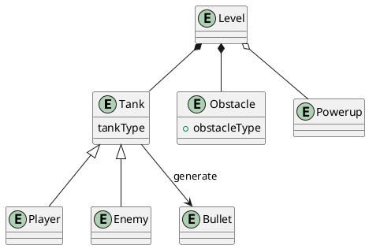

# 2.1 Business
L'applicazione sviluppata dovrà avere le seguenti caratteristiche:
- Permette all'utente di svolgere/giocare delle partite ad un clone del gioco [Battle City](https://it.wikipedia.org/wiki/Battle_City) nella sua modalità classica a giocatore singolo;
- Opzionalmente, potranno essere rese disponibili altre modalità di gioco alternative;
- L'applicativo dovrà replicare, nel modo più fedele possibile, le meccaniche di gioco base.
# 2.2 Modello del dominio
Il dominio è definito dalle caratteristiche del gioco Battle City (con le caratteristiche e restrizioni descritte nel paragrafo precedente). 
Ciò comporta il controllo di un carro armato attraverso un labirinto, la distruzione dei carri nemici e la protezione della propria base supportati da eventuali potenziamenti
Le seguenti entità sono state estrapolate nel definire un modello per tale dominio:
 1. Livello: rappresenta un singolo stage all'interno del gioco
 2. Carro armato: entità attiva principale del gioco, rappresenta da una parte l'agente con cui interagisce l'utente (giocatore) e dall'altra un'entità manipolata da AI (nemico)
 3. Ostacolo: costituiscono la struttura dei livelli, possono avere diverse caratteristiche a seconda della loro categoria. La base del player rappresenta l'ostacolo piu' importante: la sua distruzione da parte dei nemici comporta la sconfitta istantanea 
 4. Potenziamento: possono essere raccolti sul suolo del livello durante il gioco: permettono l'acquisizione di potenziamenti per il carro armato del giocatore, depotenziamenti per i nemici o alterazioni del livello di gioco
 5. Proiettile: permette di danneggiare nemici o il giocatore. 

# 2.3 Funzionali
## 2.3.1 Utente
### 2.3.1.1 Menù principale e delle opzioni
- Pulsante per avviare di una nuova partita
- Possibilità di modificare il nome dell'utente
- Possibilità di azzerare il punteggio massimo salvato
- Pulsante per chiudere l'applicativo
### 2.3.1.2 Menù di pausa
- Pulsante per riprendere il gioco
- Pulsante per l'abbandono della partita e ritorno al menù principale
### 2.3.1.3 Schermata di *gameover*
- Visualizzazione punteggio ottenuto nella partita
- Visualizzazione testo se il punteggio ottenuto è il nuovo punteggio più alto
- Pulsante per l'inizio di una nuova partita
- Pulsante per il ritorno al menù principale
### 2.3.1.4 Svolgimento del gioco
- Movimento del proprio carro armato
- Sparo dei proiettili dal proprio carro armato
- Possibilità di mettere in pausa il gioco
- Visualizzazione delle proprie vite rimanenti
- Visualizzazione dei carri armati nemici rimasti da sconfiggere
- Visualizzazione del numero/indice del livello corrente
- Visualizzazione di una schermata di riepilogo al *gameover*
- Visualizzazione di una schermata di riepilogo al completamento del gioco
## 2.3.2 Sistema
### 2.3.2.1 Comportamento dei nemici
- Movimento dei nemici tramite AI
- Sparo dei proiettili nemici tramite AI
### 2.3.2.2 Interazioni tra entità
- Collisione dei carri armati con gli ostacoli di tipo solido nel mondo di gioco
- Creazione di nemici speciali per l'ottenimento di potenziamenti quando distrutti
- Attivazione dei potenziamenti quando raccolti dal carro armato del giocatore
- Distruzione degli ostacoli danneggiabili se colpiti con un proiettile
- Danneggiamento e distruzione dei carri armati nemici tramite proiettili del giocatore
- Perdita di vita e distruzione del carro armato del giocatore tramite proiettili nemici
- Distruzione della base del giocatore tramite proiettili nemici
### 2.3.2.3 Avanzamento nel gioco
- Avanzamento di livello alla distruzione del numero di nemici richiesto dal livello
- Persistenza tra livelli delle vite rimanenti e del punteggio del giocatore 
- Fallimento del livello ("*gameover*") alla distruzione della base del giocatore
- Vittoria del gioco al completamento di tutti i livelli
- Mantenimento del punteggio massimo ottenuto tra tutte le partite giocate
- Persistenza del punteggio massimo alla chiusura dell'applicativo
# 2.4 Non funzionali
- Funzionamento dell'applicativo su Windows e Linux
- Opzionalmente, funzionamento dell'applicativo su MacOS
- Interfaccia utente responsiva al ridimensionamento della finestra
# 2.5 Implementativi
L'applicazione sarà sviluppata utilizzando il linguaggio [Scala](https://www.scala-lang.org/), con la verifica delle singole componenti e delle funzionalità tramite la libreria [scalatest](https://www.scalatest.org/).