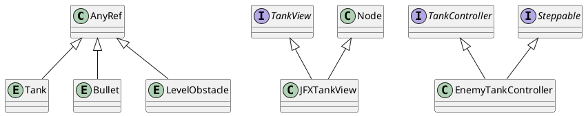
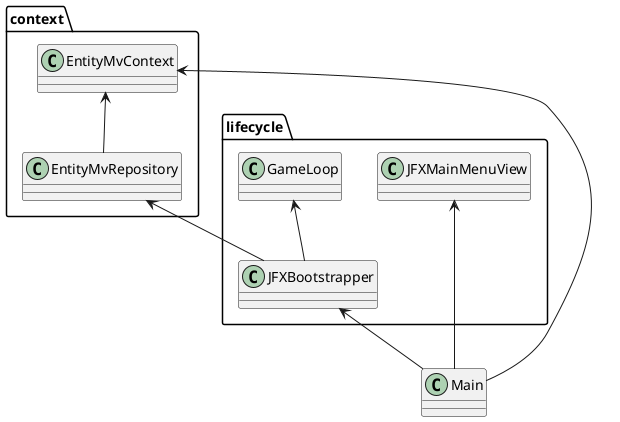

# 3.1 MVP
## 3.1.1 Introduzione a MVP
L'applicazione è stata progettata e sviluppata utilizzando il pattern [*Model-View-Presenter*](https://en.wikipedia.org/wiki/Model%E2%80%93view%E2%80%93presenter) (o *MVP*), ovvero una variante del pattern [*MVC*](https://en.wikipedia.org/wiki/Model%E2%80%93view%E2%80%93controller).
Questo ci permette di mantenere completamente separate e indipendenti le parti di *Model* e *View* tra loro, lasciando al *Presenter*/*Controller* il compito di metterle in comunicazione e tenerle sincronizzate tra loro.
In questo modo, si minimizzano le dipendenze nell'applicazione, oltre che avere per ogni *Model* e *View* un'unica fonte di verità da cui arrivano le modifiche, ovvero il *Presenter*, rendendo in generale l'applicazione più scalabile e più mantenibile.
## 3.1.2 Utilizzo nell'applicazione
Nel nostro caso specifico, nell'applicazione abbiamo considerato ogni entità di gioco, sia statica che dinamica, come una coppia *Model-View* (con *View* opzionale) che, di per sé, non fornisce alcun comportamento specifico, ma solo modi per modificare le proprietà e di reagire alle modifiche tramite eventi.
Al contrario, la logica specifica di ogni entità è implementata tramite il *Presenter* (che abbiamo optato di nominare comunque *Controller* nel codice a fine di mantenere una nomenclatura più generale), il quale ha i compiti di:
1. Gestisce il *Model*, variandolo in base agli input dell'utente, alle decisioni prese dall'AI oppure dagli eventi di gioco;
2. Reagisce agli eventi di modifica del *Model* per aggiornare la sua *View* corrispondente.
Un'altra nota sulla nostra implementazione è che abbiamo deciso di non avere delle interfacce, *trait* o classi "base" specifici per le componenti di *Model* e *View* delle entità, al fine di avere poter sviluppare in modo più libero e avere un sistema più generico per la loro gestione.
Per questo:
- Ai *Model* è richiesto di essere solo delle `AnyRef`, in quanto il sistema ha bisogno di avere delle loro istanze (e quindi non funzionerebbe correttamente in caso di utilizzo di `AnyVal`);
- Per le *View* si richiede di essere `Node`, l'elemento base delle interfacce di scalafx. Inoltre, per evitare riscritture di codice, sono stati creati dei *mixin* base che forniscono delle funzionalità comuni a tutte le *View*, come `MoveableView` o `DirectionableView` (e le loro estensioni specifiche `JFXMoveableView` e `JFXDirectionableView`).
Per i *Presenter* delle entità, invece, visto il loro compito di dover aggiornare i propri *Model* e *View*, è richiesto di ereditare l'interfaccia `Steppable`, in quanto è con essa che abbiamo gestito l'evoluzione nel tempo delle entità nel gioco.

# 3.2 Architettura generale
L'architettura generale dell'applicazione è la seguente:

Dove abbiamo, come principali componenti attive:
- `Main`: L'oggetto che istanzia l'applicazione di *JavaFX*, che crea l'oggetto del [contesto di visualizzazione](4_Design_di_dettaglio.md#4%202%20Contesto%20di%20visualizzazione) e che mostra il menù principale;
- [`JFXBoostrapper`](4_Design_di_dettaglio.md#4%203%201%20Bootstrapper):  Oggetto che incapsula la inizializzazione di una partita;
- [`GameLoop`](4_Design_di_dettaglio.md#4%203%202%20GameLoop): Oggetto che gestisce e avanza lo stato di gioco;
Si è scelto di utilizzare questa architettura standard nello sviluppo di un gioco in quanto permette la separazione tra gli stati globali dell'applicazione mentre si è "in-gioco" piuttosto che "fuori" dal gioco.
## 3.2.2 Architettura come MVP
L'architettura sopra descritta è stata anche pensata per seguire il pattern *MVP*, ad un livello più alto rispetto a come viene sfruttato nel gioco.
Infatti, per le varie componenti citate abbiamo:
- `Main` come *Presenter* generale;
- `JFXMainMenuView` come *View* generale;
- `JFXBootstrapper` e `GameLoop` come *Presenter in-game*;
- `EntityMvContext` come *View in-game*;
- `EntityMvRepository` come *Model in-game*.
# 3.3 Scelte tecnologiche
Le scelte tecnologiche fatte riguardano principalmente l'utilizzo della libreria [scalafx](https://www.scalafx.org/) come *wrapper* di [JavaFX](https://openjfx.io/)  che sfrutta alcune funzionalità avanzate di scala e che implementa alcune astrazioni aggiuntive per facilitarne l'uso.
Questo ha facilitato lo sviluppo delle View delle svariate entità, oltre che la realizzazione dei menù di gioco e le loro funzionalità, soprattutto grazie agli operatori che scalafx mette a disposizione per rendere reattive le proprietà dell'interfaccia.