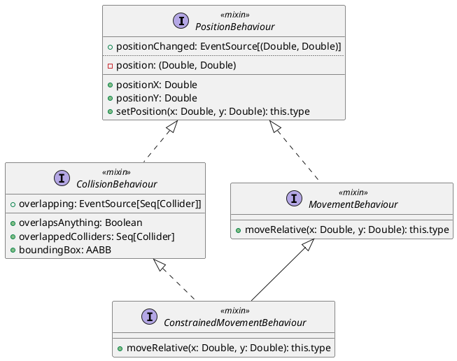
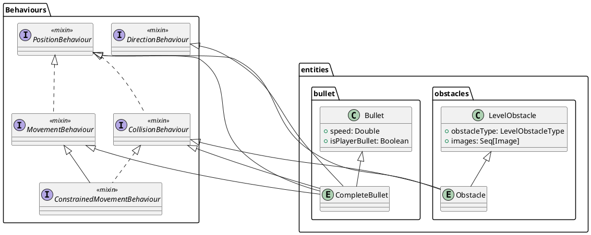

(corredato da pochi ma efficaci diagrammi)
# 3.1 MVP
## 3.1.1 Introduzione a MVP
L'applicazione è stata progettata e sviluppata utilizzando il pattern [*Model-View-Presenter*](https://en.wikipedia.org/wiki/Model%E2%80%93view%E2%80%93presenter) (o *MVP*), ovvero una variante del pattern [*MVC*](https://en.wikipedia.org/wiki/Model%E2%80%93view%E2%80%93controller).
Questo ci permette di mantenere completamente separate e indipendenti le parti di *Model* e *View* tra loro, lasciando al *Presenter*/*Controller* il compito di metterle in comunicazione e tenerle sincronizzate tra loro.
In questo modo, si minimizzano le dipendenze nell'applicazione, oltre che avere per ogni *Model* e *View* un'unica fonte di verità da cui arrivano le modifiche, ovvero il *Presenter*, rendendo in generale l'applicazione più scalabile e più mantenibile.
## 3.1.2 Utilizzo nell'applicazione
Nel nostro caso specifico, nell'applicazione abbiamo considerato ogni entità di gioco, sia statica che dinamica, come una coppia *Model-View* (con *View* opzionale) che, di per sé, non fornisce alcun comportamento specifico, ma solo modi per modificare le proprietà e di reagire alle modifiche tramite eventi.
Al contrario, la logica specifica di ogni entità è implementata tramite il *Presenter* (che abbiamo optato di nominare comunque *Controller* nel codice a fine di mantenere una nomenclatura più generale), il quale ha i compiti di:
1. Gestisce il *Model*, variandolo in base agli input dell'utente, alle decisioni prese dall'AI oppure dagli eventi di gioco;
2. Reagisce agli eventi di modifica del *Model* per aggiornare la sua *View* corrispondente.
# 3.2 Ciclo di vita dell'applicazione
## 3.2.1 Contesto di visualizzazione
### 3.2.1.1 Funzionamento
Per permettere la generalizzazione della struttura dell'interfaccia utente e un eventuale cambio di layout a *runtime* il più semplice possibile, è stato creato un sistema di contesti di visualizzazione per i *Model-View*. Questo sistema:
1. A livello base, è completamente astratto dal tipo di libreria grafica utilizzata;
2. Permette di creare dei *preset* di layout dell'interfaccia tramite degli oggetti `ContextInitializer`;
3. Permette ad ogni *View* di controllare la propria presenza nell'interfaccia impostando in essa la zona di layout in cui deve essere visibile tramite uno *slot*, senza la necessità di avere un oggetto di livello superiore che la crei e la aggiunga al layout manualmente.
### 3.2.1.2 Utilizzo
Nel nostro caso, abbiamo due contesti:
- Il contesto *ui-only*, che possiede un singolo slot per mostrare un menù all'utente;
- Il contesto *ingame*, che possiede uno slot per mostrare il campo di gioco, uno per la barra laterale con le informazioni della partita, e uno slot *overlay* che permette di sovrapporre degli elementi a tutto il resto (utilizzato per il menù di pausa).

Inoltre, per renderne l'utilizzo più semplice, è stato sfruttato il sistema dei `given`/`using` di Scala, grazie al quale abbiamo semplificato la creazione degli oggetti che utilizzano il contesto di visualizzazione.
## 3.2.2 Composizione delle entità
Nell'applicazione, i *Model* delle entità sono definiti da:
1. Un tipo specifico per l'entità, che ne contiene le proprietà specifiche (ad esempio, le classi `Tank`, `Bullet`, `LevelObstacle`);
2. Un certo numero di *Behaviour* aggiuntivi che forniscono alle entità le informazioni e le operazioni necessarie per implementare un dato comportamento.
Sfruttando il meccanismo dei *mixin* di Scala, i *Behaviour* sono stati implementati come `trait`, ognuno dei quali fornisce una funzionalità molto specifica che si può basare su altri *Behaviour*.
Inoltre, utilizzando i *self-type*, è stato possibile fornire un meccanismo di dipendenze tra essi senza dover però utilizzare l'ereditarietà.
Infine, un altro aspetto che abbiamo utilizzato molto, non solo per i *Behaviour* ma per i mixin in generale, è sfruttare il tipo di ritorno `type.type`, per permettere di ritornare un oggetto con il suo tipo finale, al contrario di come sarebbe normalmente, ovvero utilizzando `this`  come valore di ritorno si avrebbe un oggetto con solo il tipo del *mixin* in cui la funzione è dichiarata.

In questo modo, quando le entità vengono costruite creando istanze degli oggetti dell'entità specifica, i *Behaviour* vengono aggiunti in modo modulare e, nel caso vi fossero dipendenze non rispettate tra loro, l'errore è segnalato già a *compile-time* dal compilatore.

## 3.2.2 Repository delle entità
Esse sono mantenute nella repository delle entità dove, per ogni entità, il suo *Model* è considerato la sua "istanza" in gioco e ad esso può esistere una *View* associata corrispondente che, durante la vita dell'entità, può essere rimpiazzata se necessario senza modificare il *Model*.
Ogni volta che un *Model* o una coppia *Model-View* viene aggiunta alla repository, la creazione del loro *Controller*/*Presenter* è affidata ad una estensione della repository; Questa permette, prima di 

# 3.3 Scelte tecnologiche