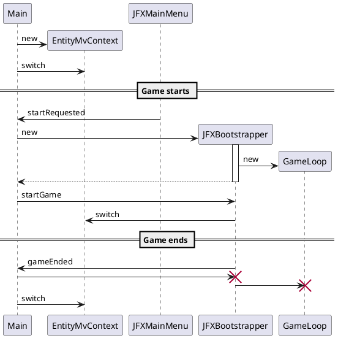
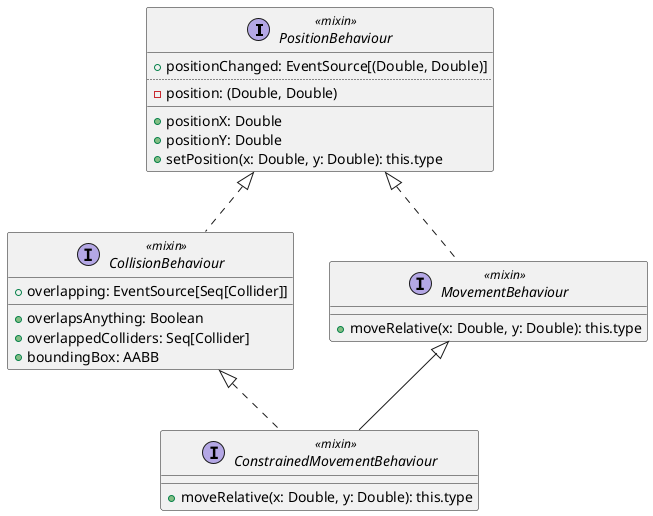
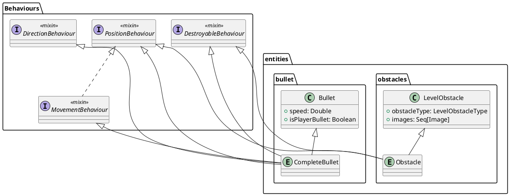
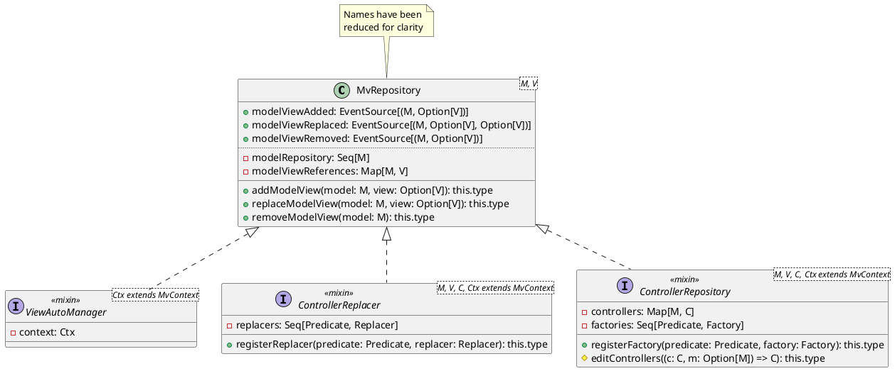
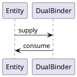
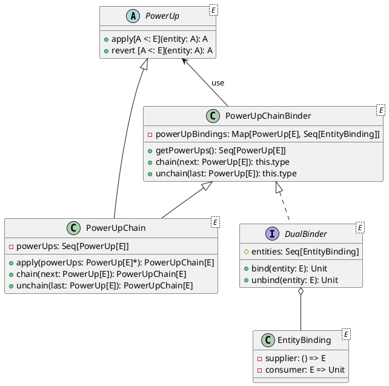

# 4.1 Eventi
Un aspetto pervasivo nell'applicazione è la gestione della reattività ad azioni e modifiche di dati.
Per fornire un sistema facile da utilizzare e flessibile è stato implementato un tipo `EventSource[A]`, ispirato al sistema di eventi presente in C#.
Esso modella un evento con un certo tipo di parametro sul quale è possibile registrarsi o de-registrarsi come ascoltatori tramite gli operatori `+=` e `-=`: questo evento può inoltre essere invocato (operazione generalmente fatta dall'oggetto che li espone).
# 4.2 Contesto di visualizzazione
## 4.2.1 Funzionamento
Per permettere la generalizzazione della struttura dell'interfaccia utente e un eventuale cambio di layout a *runtime* il più semplice possibile, è stato creato un sistema di contesti di visualizzazione per i *Model-View*. Questo sistema:
1. A livello base, è completamente astratto dal tipo di libreria grafica utilizzata;
2. Permette di creare dei *preset* di layout dell'interfaccia tramite degli oggetti `ContextInitializer`;
3. Permette ad ogni *View* di controllare la propria presenza nell'interfaccia impostando in essa la zona di layout in cui deve essere visibile tramite uno *slot*, senza la necessità di avere un oggetto di livello superiore che la crei e la aggiunga al layout manualmente.
Nello specifico, il sistema è composto da una classe principale `EntityMvRepositoryContext`, che contiene una mappa da *view slot* a *view container*, e un metodo `switch` per cambiare il contesto tramite un `EntityMvRepositoryContextInitializer`.
## 4.2.1 Utilizzo
Nel nostro caso, abbiamo due contesti:
- Il contesto *view*, che possiede un singolo slot per mostrare un menù all'utente;
- Il contesto *level*, che possiede il layout di gioco, ovvero uno slot centrale per mostrare il campo di gioco, uno sulla destra per la barra laterale con le informazioni della partita, e uno di *overlay* che permette di sovrapporre degli elementi a tutto il resto (utilizzato per il menù di pausa).
Inoltre, per renderne l'utilizzo più semplice, è stato sfruttato il sistema dei `given`/`using` di Scala, grazie al quale abbiamo impostato un'istanza del contesto come `given`, semplificando la creazione degli oggetti che lo utilizzano.
# 4.3 Ciclo di vita dell'applicazione

## 4.3.1 *Bootstrapper*
L'inizializzazione della partita è incapsulata da un oggetto `JFXGameBootstrapper` che va ad inizializzare le componenti richieste e che fornisce un metodo `startGame()` per passare al contesto di gioco e iniziare la partita.
Questo oggetto, inoltre, fornisce gli eventi `gameEnded` e `gameRestarted`, che vengono utilizzati da chi crea il *bootstrapper* (e quindi da chi avvia il gioco) per tornare al menù principale o resettare la partita.
## 4.3.2 GameLoop
Durante il gioco, l'avanzamento e la gestione del tempo è effettuata da un oggetto `GameLoop` che va ad effettuare ad ogni *frame* di gioco (nel nostro caso tramite un `AnimationTimer`)  uno *step* sulla [*repository* delle entità](4_Design_di_dettaglio.md#3%202%202%20Repository%20delle%20entità).
Sarà poi la *repository* stessa ad effettuare lo *step* sui singoli componenti dinamici del gioco, ovvero i *Presenter* nel nostro caso.
Tutto questo è gestito tramite una semplice interfaccia `Steppable` che richiede l'implementazione di un metodo `step(delta: Double): this.type`, al cui interno verrà eseguita la logica di gioco.
## 4.3.3 Gestione dei livelli
I diversi livelli e componenti che compongono ciascun livello vengono dapprima caricati a partire da file risorse tramite un `LevelLoader`, che restituisce
tramite un metodo `getLevel()` tutte le informazioni del layout e della sequenza di nemici per ciascun livello. A seguito, queste informazioni vengono passate ad oggetto `LevelFactory` che rielabora
i parametri passati per la generazione dei suddetti livelli. 
## 4.3.4 Pausa del gioco
La pausa è stata gestita tramite un *mixin* `Pausable` che fornisce la funzionalità di poter impostare un oggetto come in-pausa in modo osservabile.
Questo è stato implementato all'interno dei controller di `Tank` e `Bullet` (in quanto sono le due entità dinamiche dell'applicazione) per interromperne il normale funzionamento mentre il gioco è in pausa.
## 4.3.5 Gameover
Quando il giocatore esaurisce le vite, il gioco viene terminato, passando ad un altro contesto in cui è mostrata una interfaccia di *gameover*: da qui l'utente può visionare il proprio punteggio, chiudere il gioco oppure iniziare una nuova partita.
# 4.4 Gestione delle entità
Nell'applicazione, i *Model* delle entità sono definiti da:
1. Un tipo specifico per l'entità che rappresentano, che ne contiene le proprietà specifiche (ad esempio, le classi `Tank`, `Bullet`, `LevelObstacle`);
2. Un certo numero di *Behaviour* aggiuntivi che forniscono alle entità le informazioni e le operazioni necessarie per implementare un dato comportamento.
## 4.4.1 Composizione delle entità
Sfruttando il meccanismo dei *mixin* di Scala, i *Behaviour* sono stati implementati come `trait`, ognuno dei quali fornisce una funzionalità molto specifica che si può basare su altri *Behaviour*.
Inoltre, utilizzando i *self-type*, è stato possibile fornire un meccanismo di dipendenze tra essi senza dover però utilizzare l'ereditarietà.
L'elenco dei *Behaviour* disponibili è il seguente:
- `PositionBehaviour`: Fornisce una posizione modificabile e osservabile `(x, y)`;
- `DirectionBehaviour`: Fornisce una direzione modificabile e osservabile `(x, y)`, oltre che l'ultima direzione valida (non-zero);
- `CollisionBehaviour`: Estende `Collider` e fornisce reattività e gestione delle collisioni con altre entità;
- `MovementBehaviour`: Fornisce un metodo per il movimento dell'entità in base ad un certo spostamento;
- `ConstrainedMovementBehaviour`: Aggiunge il controllo delle collisioni al `MovementBehaviour`;
- `MultipleTankShootingBehaviour`: Utilizzato dalle entità `Tank`, permette di istanziare un numero variabile di proiettili in base alla propria posizione e direzione;
- `DestroyableBehaviour`: Permette all'entità di essere danneggiata e/o distrutta on modo osservabile;

Lo schema seguente mostra una parziale gerarchia dei *Behaviour* e dell'utilizzo dei *self-type* oltre che della normale ereditarietà:

In questo modo, quando le entità vengono costruite, creando istanze degli oggetti dell'entità specifica, i *Behaviour* vengono aggiunti in modo modulare e, nel caso vi fossero dipendenze non rispettate tra loro, l'errore è segnalato già a *compile-time* dal compilatore.
Nello schema seguente è mostrato un esempio (parziale) di come possono essere composte due entità diverse:

## 4.4.2 Repository delle entità
Tutte le coppie *Model-View* delle entità sono mantenute in una repository detta `EntityMvRepositoryContainer` dove ogni *Model* è considerato come l'istanza in gioco dell'entità.
Per ogni *Model* può esistere una *View* associata corrispondente che, durante la vita dell'entità, può essere rimpiazzata se necessario senza modificare il *Model*.
Inoltre, per reagire alla modifica della repository con alcuni comportamenti specifici e per integrarla con i sistemi di gioco, sono state create alcune estensioni come `trait` *mixin*, che verranno illustrati qui a seguire.
### 4.4.2.1 Gestione dei Presenter
Ogni volta che un *Model* o una coppia *Model-View* viene aggiunta alla repository, la creazione del loro *Controller*/*Presenter* è affidata all'estensione della repository `EntityControllerRepository`.
Questa permette di:
- Registrare dei metodi *factory* di *Presenter*, assieme ad un dato *predicato* che indicherà per quali *Model* eseguirlo;
- Rimuovere il *Presenter* associato ad un dato *Model* quando quest'ultimo viene eliminato dalla *repository*.

Inoltre, una ulteriore estensione `EntityControllerReplacer`, permette in modo similare di registrare dei *replacer* allo stesso modo delle *factory* per rimpiazzare un *Presenter* di un *Model* quando viene rimpiazzata la *View* ad esso associata.
### 4.4.2.2 Altre estensioni della repository
- `EntityViewAutoManager`: Permette di aggiungere e rimuovere in automatico le *View* in un dato *view slot* del [contesto di visualizzazione](3_Architettura.md#3%202%201%20Contesto%20di%20visualizzazione) corrente;
- `EntityColliderAutoManager`: Permette di registrare e de-registrare in automatico i *Model* fisici, ovvero quelli che derivano da `Collider`, sul mondo fisico (`PhysicsWorld`);
- `DestroyableEntityAutoManager`: Permette di rimuovere dalla repository le entità i cui *Model* derivano da `DestroyableBehaviour` quando viene invocato l'evento `destroyed` su di esse;
- `EntityRepositoryPausableAdapter`: Rende la repository un oggetto `Pausable` nel quale, quando viene cambiato lo stato di pausa, esso viene impostato anche su tutti i *Presenter* che derivano da `Pausable`.
- `EntityRepositoryTagger`: Permette di assegnare un *tag* ad ogni entità, ovvero un valore che può essere utilizzato per raggrupparle. Nel nostro caso è stato utilizzato per marcare tutti i *Model* che sono collegati ad una singola entità (come il caso dell'ostacolo `BrickWall` che, per ogni entità, crea $16$ coppie *Model*-*View* per ogni frammento).

# 4.5 Gestione dei power-up sulle entità 
Considerando la natura molto eterogenea dei *power-up*, Il sistema per la loro gestione ed applicazione è stato costruito in modo generico rispetto all'effetto da applicare e/o rimuovere e al tipo di entità sul quale possono essere applicati.
Questo tramite due tipi di oggetti principali:
- `PowerUp`: Permette di applicare ed invertire l'effetto di un *power-up* su di un' entità. Una volta fatto ciò, viene ritornata la nuova entità modificata;
- `PowerUpChain`: Fornisce le funzionalità necessarie a concatenare un numero variabile di `PowerUp`. Si mantiene identico nell'uso in quanto rimane anch'esso un `PowerUp`.
## 4.5.1 *Dual-Binding* delle entità
Per fornire un sistema che potesse mantenere traccia e aggiornare in maniera reattiva le entità affette da *power-up* si è scelto di realizzare un doppio binding tra queste e il sistema in questione.
Ciò è compiuto tramite i seguenti componenti:
- `DualBinder`: Permette di legare e slegare un doppio riferimento ad un'entità;
- `EntityBinding`: *case class* mantenuta all'interno del  `DualBinder`.  Rappresenta il doppio riferimento ad un'entità ed è costituita da:
	- `supplier`: Permette di ottenere lo stato corrente dell'entità. Ciò permette di lavorare direttamente con lo stato attuale delle entità a prescindere dai cambiamenti successivi alla fase di binding;
	- `consumer`: Permette di aggiornare lo stato di un'entità mantenendo consistente il suo uso dall'esterno.

Questo approccio fornisce diversi vantaggi:
 - è possibile lavorare sulle entità semplificando il tracciamento dei suoi cambiamenti di stato da parte di altri sistemi;
 - Ogni modifica sull'entità è riflessa immediatamente, nel caso vi sia alcun bisogno di lavorare su sue  copie o stati.
## 4.5.2 Descrizione generale del sistema
Per l'utilizzo finale in gioco le componenti precedentemente descritte (`PowerUpChain` e `DualBinder`) sono state integrate in un' unica componente `PowerUpChainBinder`, che ne integra le funzionalità, permettendo di:
 - Registrare le entità sulle quali verranno applicati i *power-up*;
 - Concatenare *power-up* al sistema facendo in modo che questi vengano eseguiti.

Alcune note:
 - Il `PowerUpChainBinder` applica i *power-up* solo su entità attualmente registrate, facendo in modo che il sistema si mantenga dinamico e flessibile anche a seguito di multiple chiamate di `bind` e `unbind`;
 - La logica di applicazione rimane vincolata al solo *power-up*: nessun altro componente possiede informazioni sul loro risultato effettivo.

# 4.6 Pattern di progettazione
## Builder
L'utilizzo dei *builder* ci ha permesso per quei tipi di entità più complesse, ovvero i *tank*, di poterne specificare le proprietà in maniera semplificata.
Inoltre, questi builder sono stati implementati in modo funzionale sfruttando le *case class* e il loro metodo `copy`, per creare nuove istanze del builder modificando solo alcuni parametri e lasciando invariati gli altri.
## Factory e Factory methods
Le *factory* sono state ampiamente utilizzate per la creazione di oggetti molto comuni o (unite anche al pattern strategy) quando era necessario indicare ad un oggetto come creare, per uso interno o esterno, un altro oggetto.
## Singleton
Si è cercato di limitare l'uso dei *singleton* a favore di parametri `using` dove possibile e dove opportuno, in quanto tendono a rendere il codice più opaco su ciò che si usa internamente e anche dipendente dal singleton in maniera stretta. Comunque si è ritenuto opportuno usare alcuni oggetti globali singleton, soprattutto per quando riguarda la creazione delle factory di oggetti o per quei sistemi globali non centrali al funzionamento.
## Pattern Strategy
Grazie al supporto avanzato di scala per *higher-order functions*, *currying* e per i *type alias* si è fatto uso abbondante del pattern strategy non solo per ottenere codice più riutilizzabile e generico, ma anche per poter scrivere classi e `trait` con comportamenti forniti dall'esterno senza legarne l'implementazione a specifiche interfacce.
## *Self-type*
Il meccanismo dei *self-type* è stato molto utilizzato per avere una definizione dichiarativa delle dipendenze di un oggetto, non solo come già illustrato nella [composizione delle entità](4_Design_di_dettaglio.md#4%204%201%20Composizione%20delle%20entità), ma in generale in tutta l'applicazione.
## Producer-consumer
Pattern utilizzato in particolare per i *power-up* per la modifica di oggetti in modo completamente funzionale e indipendente da eventuali interfacce specifiche, sfruttando un producer per ottenere l'oggetto di partenza e un consumer per fornire il risultato.
## Adapter
Il pattern dell'adapter è stato utilizzato principalmente nello sviluppo delle estensioni della [repository delle entità](4_Design_di_dettaglio.md#4%204%202%20Repository%20delle%20entità), in quanto il loro scopo è adattare i suoi eventi a scopi diversi per i vari sistemi di gioco.
## Template method
Pattern che abbiamo molto utilizzato parallelamente alle factory e ai builder, andando a creare classi con metodi protetti astratti, implementati poi *in-place* all'interno dei metodi di costruzione in modo da semplificare il codice.
## Observer
Come già citato nella descrizione degli [eventi](4_Design_di_dettaglio.md#4%201%20Eventi), abbiamo ampiamente fatto uso di questo pattern per il trasporto delle informazioni e per la notifica degli avvenimenti di gioco tra i vari sistemi senza doverli esplicitamente legare tra loro.